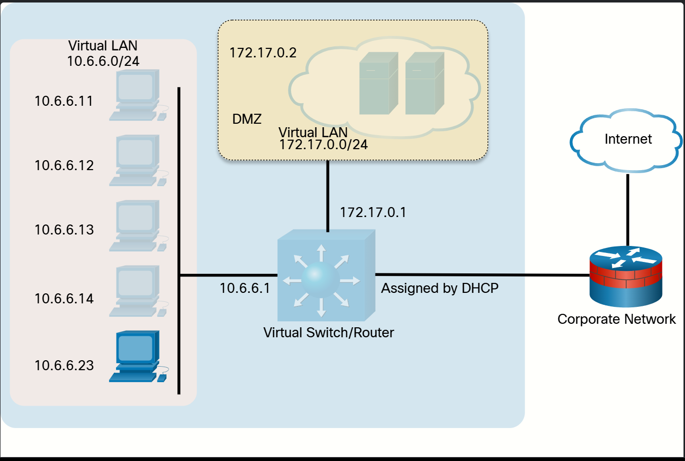
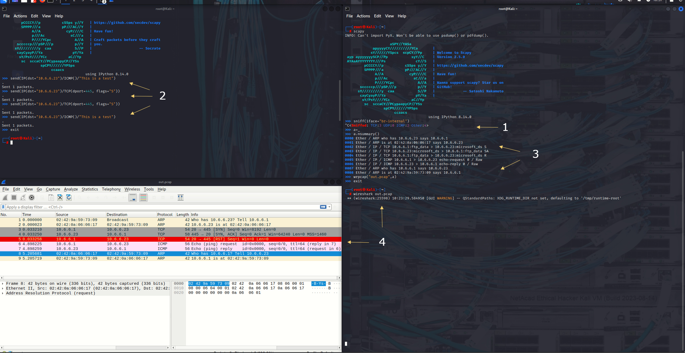
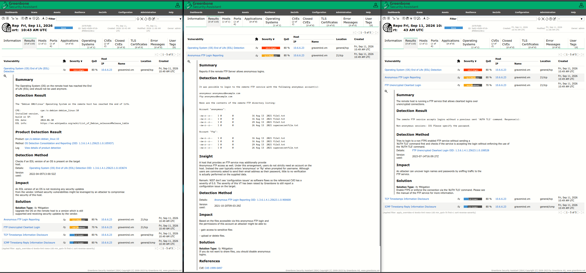
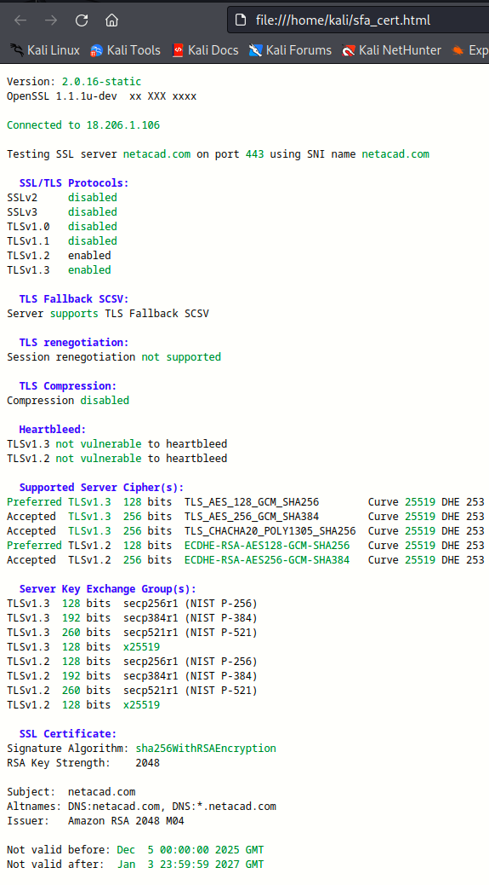

# Active Reconnaissance: Field Notes

> Consolidated write-up of five Cisco Ethical Hacker active-recon labs (Nmap Enumeration, Scapy Packet Crafting, Vulnerability Scanning with Vulners + GVM, SMB Enumeration with enum4linux, Web Vulnerability Scanning with Nikto). All commands run from the course Kali VM. First-person voice: my own field notes, not a lab transcript.
> The customized distribution used in conducting tests in this write-up is available at [Ethical Hacker Kali Linux](https://www.netacad.com/resources/lab-downloads?courseLang=en-US)

---

## TL;DR: Tool Index

| Phase           | Tool          | One-liner                                             | What it gives you                        |
| --------------- | ------------- | ----------------------------------------------------- | ---------------------------------------- |
| Host discovery  | Nmap `-sn`    | `nmap -sn 10.6.6.0/24`                                | Live hosts in a subnet                   |
| Port scan       | Nmap default  | `nmap 10.6.6.23`                                      | Top 1000 TCP ports                       |
| Port scan       | Nmap `-sS`    | `sudo nmap -sS 10.6.6.23`                             | TCP SYN (stealth) scan                   |
| OS fingerprint  | Nmap `-O`     | `sudo nmap -O 10.6.6.23`                              | Target OS guess                          |
| Service version | Nmap `-sV`    | `nmap -sV 10.6.6.23`                                  | Service banner + version                 |
| Aggressive      | Nmap `-A`     | `nmap -A -p139,445 10.6.6.23`                         | OS + version + scripts + traceroute      |
| NSE scripts     | Nmap scripts  | `smb-enum-shares.nse, smb-enum-users, vuln.nse`       | Targeted enumeration                     |
| Vuln scan       | GVM / OpenVAS | `sudo gvm-start` → Web UI at `https://127.0.0.1:9392` | Full authenticated vuln scan, PDF report |
| Packet craft    | Scapy         | `send(IP(dst="10.6.6.23")/TCP(dport=445, flags="S"))` | Custom packet forge / sniffer            |
| SMB enum        | enum4linux    | `enum4linux -a 10.6.6.23`                             | Users, shares, groups, password policy   |
| SMB client      | smbclient     | `smbclient //172.17.0.2/tmp` → `put badfile.txt`      | Browse/upload via SMB                    |
| Web scan        | Nikto         | `nikto -h 172.17.0.2 -o out.htm`                      | Web server misconfigs + CVEs             |
| SSL             | sslscan       | `sslscan netacad.com \| aha > out.html`               | Cipher / protocol / cert config audit    |

---

## Lab Topology

The course Kali VM is bridged to two virtual networks. Knowing which target lives where saves time when scoping a scan.



- **DMZ interface**: `br-internal` (IP `10.6.6.1`): used to reach `10.6.6.23`.
- **172.17.0.x interface**: Docker bridge: used to reach `172.17.0.2`.
- **Targets to be scanned**: `10.6.6.23` and `172.17.0.2` 

---

## 1. Host Discovery & Port Scanning:  Nmap

Nmap is the workhorse of active recon. The lab scenario was straightforward: a Wireshark capture flagged unusual activity from `10.6.6.23`, and I needed to enumerate the box to find services and likely-vulnerable versions.
### Purpose
 Discover live hosts, enumerate open ports, identify the OS, service versions, and run targeted enumeration scripts: all without (yet) attempting exploitation.

### Usage
```bash
nmap -V                           # version check
nmap -h                           # quick help
man nmap                          # full manual

# Discovery (no port scan)
nmap -sn 10.6.6.0/24             # ping sweep: ICMP echo + TCP SYN/ACK to 80/443

# Port scans
nmap 10.6.6.23                    # default = TCP connect on top 1000 ports
sudo nmap -sS 10.6.6.23          # TCP SYN (stealth) scan
sudo nmap -O 10.6.6.23           # OS detection (needs root)
nmap -sV 10.6.6.23               # service version detection
nmap -A -p139,445 10.6.6.23      # aggressive: OS + version + scripts + traceroute
nmap -v -p21 -sV -T4 10.6.6.23   # verbose, single port, version, fast timing
nmap --open 10.6.6.23            # show only open ports
nmap -T<0-5> 10.6.6.23           # timing template (0=paranoid, 5=insane)

# NSE scripts
nmap --script smb-enum-users.nse -p139,445 10.6.6.23
nmap --script smb-enum-shares.nse -p445 10.6.6.23
```

Key options I keep coming back to:

| Flag | What it does |
|---|---|
| `-A` | Aggressive: OS + version + scripts + traceroute |
| `-O` | OS detection |
| `-p <ranges>` | Specific ports (`-p21,80,445` or `-p1-1024`) |
| `-sF` | TCP FIN scan (evades some firewalls) |
| `-sn` | Host discovery only, no port scan |
| `-sS` | TCP SYN (half-open) scan |
| `-sT` | TCP connect scan (full handshake) |
| `-sV` | Probe for service / version |
| `-T<0-5>` | Timing: higher is faster, lower is stealthier |
| `-v` | Verbose |
| `--open` | Show only open ports (suppress closed/filtered) |

### Findings
```
┌──(kali㉿Kali)-[~]
└─$ nmap -sn 10.6.6.0/24 
Starting Nmap 7.94 ( https://nmap.org ) at 2026-09-09 11:42 UTC
Nmap scan report for 10.6.6.1
Host is up (0.00019s latency).
Nmap scan report for webgoat.vm (10.6.6.11)
Host is up (0.00050s latency).
Nmap scan report for juice-shop.vm (10.6.6.12)
Host is up (0.00047s latency).
Nmap scan report for dvwa.vm (10.6.6.13)
Host is up (0.000056s latency).
Nmap scan report for mutillidae.vm (10.6.6.14)
Host is up (0.000029s latency).
Nmap scan report for gravemind.vm (10.6.6.23)
Host is up (0.00040s latency).
Nmap scan report for 10.6.6.100
Host is up (0.000096s latency).
Nmap done: 256 IP addresses (7 hosts up) scanned in 7.95 seconds

```
 returned 7 live hosts** in the DMZ (including the Kali host itself). 

```
Starting Nmap 7.94 ( https://nmap.org ) at 2026-09-09 11:45 UTC
Nmap scan report for gravemind.vm (10.6.6.23)
Host is up (0.00011s latency).
Not shown: 994 closed tcp ports (conn-refused)
PORT    STATE SERVICE
21/tcp  open  ftp
22/tcp  open  ssh
53/tcp  open  domain
80/tcp  open  http
139/tcp open  netbios-ssn
445/tcp open  microsoft-ds

Nmap done: 1 IP address (1 host up) scanned in 0.04 seconds
```

 A default scan against `10.6.6.23` showed six open TCP ports: `21, 22, 53, 80, 139, 445`. Port-state semantics matter for the report: `open` (got SYN-ACK) = service listening; `closed` (got RST) = no service; `filtered` (no response or ICMP unreachable) = firewall.

```
┌──(kali㉿Kali)-[~]
└─$ sudo nmap -O 10.6.6.23 
Starting Nmap 7.94 ( https://nmap.org ) at 2026-09-09 11:47 UTC
Nmap scan report for gravemind.vm (10.6.6.23)
Host is up (0.000031s latency).
Not shown: 994 closed tcp ports (reset)
PORT    STATE SERVICE
21/tcp  open  ftp
22/tcp  open  ssh
53/tcp  open  domain
80/tcp  open  http
139/tcp open  netbios-ssn
445/tcp open  microsoft-ds
MAC Address: 02:42:0A:06:06:17 (Unknown)
Device type: general purpose
Running: Linux 4.X|5.X
OS CPE: cpe:/o:linux:linux_kernel:4 cpe:/o:linux:linux_kernel:5
OS details: Linux 4.15 - 5.8
Network Distance: 1 hop

OS detection performed. Please report any incorrect results at https://nmap.org/submit/ .
Nmap done: 1 IP address (1 host up) scanned in 1.83 seconds
```

`sudo nmap -O 10.6.6.23` tell that the OS is **Linux 4.15 – 5.8**. `nmap -v -p21 -sV -T4 10.6.6.23` identified the FTP service as **vsftpd 3.0.3**. The `-A` scan against port 21 went further: it logged in anonymously (FTP code 230) and listed files: `file1.txt`, `file2.txt`, `file3.txt`, `supersecretfile.txt`. That's a P1 finding right there: anonymous FTP with sensitive-looking filenames.

```
┌──(kali㉿Kali)-[~]
└─$ nmap -A -p139,445 10.6.6.23
Starting Nmap 7.94 ( https://nmap.org ) at 2026-09-09 11:49 UTC
Nmap scan report for gravemind.vm (10.6.6.23)
Host is up (0.00045s latency).

PORT    STATE SERVICE     VERSION
139/tcp open  netbios-ssn Samba smbd 3.X - 4.X (workgroup: WORKGROUP)
445/tcp open  netbios-0   Samba smbd 4.9.5-Debian (workgroup: WORKGROUP)
Service Info: Host: GRAVEMIND

Host script results:
| smb2-time: 
|   date: 2026-09-09T11:49:46
|_  start_date: N/A
| smb-security-mode: 
|   account_used: <blank>
|   authentication_level: user
|   challenge_response: supported
|_  message_signing: disabled (dangerous, but default)
| smb-os-discovery: 
|   OS: Windows 6.1 (Samba 4.9.5-Debian)
|   Computer name: gravemind
|   NetBIOS computer name: GRAVEMIND\x00
|   Domain name: \x00
|   FQDN: gravemind
|_  System time: 2026-09-09T11:49:47+00:00
| smb2-security-mode: 
|   3:1:1: 
|_    Message signing enabled but not required

Service detection performed. Please report any incorrect results at https://nmap.org/submit/ .
Nmap done: 1 IP address (1 host up) scanned in 16.42 seconds
```

SMB enumeration was even richer. `nmap -A -p139,445 10.6.6.23` returned Samba `smd 4.9.5-Debian` (workgroup `WORKGROUP`), and host info `Windows 6.1 (Samba 4.9.5-Debian)`. Two NSE scripts gave me more:

```
┌──(kali㉿Kali)-[~]
└─$ nmap  -p139,445 10.6.6.23 --script=smb-enum-users.nse
Starting Nmap 7.94 ( https://nmap.org ) at 2026-09-09 11:52 UTC
Nmap scan report for gravemind.vm (10.6.6.23)
Host is up (0.00040s latency).

PORT    STATE SERVICE
139/tcp open  netbios-ssn
445/tcp open  microsoft-ds

Host script results:
| smb-enum-users: 
|   GRAVEMIND\arbiter (RID: 1001)
|     Full name:   
|     Description: 
|     Flags:       Account disabled, Password not required, Normal user account
|   GRAVEMIND\masterchief (RID: 1000)
|     Full name:   
|     Description: 
|_    Flags:       Account disabled, Password not required, Normal user account

Nmap done: 1 IP address (1 host up) scanned in 0.15 seconds
```

`smb-enum-users.nse` surfaced two usernames: `arbiter` and `masterchief`.

```
┌──(kali㉿Kali)-[~]
└─$ nmap  -p139,445 10.6.6.23 --script=smb-enum-shares.nse 
Starting Nmap 7.94 ( https://nmap.org ) at 2026-09-09 11:54 UTC
Nmap scan report for gravemind.vm (10.6.6.23)
Host is up (0.000090s latency).

PORT    STATE SERVICE
139/tcp open  netbios-ssn
445/tcp open  microsoft-ds

Host script results:
| smb-enum-shares: 
|   account_used: <blank>
|   \\10.6.6.23\IPC$: 
|     Type: STYPE_IPC_HIDDEN
|     Comment: IPC Service (Samba 4.9.5-Debian)
|     Users: 1
|     Max Users: <unlimited>
|     Path: C:\tmp
|     Anonymous access: READ/WRITE
|   \\10.6.6.23\print$: 
|     Type: STYPE_DISKTREE
|     Comment: Printer Drivers
|     Users: 0
|     Max Users: <unlimited>
|     Path: C:\var\lib\samba\printers
|     Anonymous access: READ/WRITE
|   \\10.6.6.23\workfiles: 
|     Type: STYPE_DISKTREE
|     Comment: Confidential Workfiles
|     Users: 0
|     Max Users: <unlimited>
|     Path: C:\var\spool\samba
|_    Anonymous access: READ/WRITE

Nmap done: 1 IP address (1 host up) scanned in 7.34 seconds

```

`smb-enum-shares.nse` enumerated three shares: `IPC$` (hidden, IPC service), `print$` (printer drivers), `workfiles` (confidential workfiles): and **anonymous access: READ/WRITE** on all three. Two hidden shares (names ending in `$`).

### Remediation
 For defenders: disable anonymous FTP: full stop. Restrict SMB shares to authenticated users with least-privilege ACLs; never expose `READ/WRITE` to anonymous. Close unused ports at the host firewall (e.g. `139/tcp` if only modern SMB3 over 445 is needed). Patch Samba to current. Disable SMBv1 server-side. Run Nmap against your own perimeter monthly and treat any new open port as an incident to investigate.

### Gotchas
 `-sn` no longer means "just ping": modern Nmap also sends TCP SYN/ACK to 80/443, so a host with a stealth firewall on those ports may still be detected. `-O` and `-sS` require root. Aggressive scans (`-A`) are loud: assume the IDS sees them. NSE scripts can take 20+ seconds per host when they log in and enumerate. If `-O` reports a wide range (Linux 4.15–5.8), it's a low-confidence guess: confirm with version-based fingerprinting (`-sV`).

---

## 2. Packet Crafting: Scapy

Scapy (originally by Philippe Biondi) is a Python-based packet manipulation tool. Where Nmap gives me prebuilt scans, Scapy lets me build packets byte-by-byte: useful for evading IDS signatures, fuzzing, and answering specific protocol questions Nmap can't.

### Purpose
 Sniff traffic, craft custom ICMP/TCP/UDP packets, modify header fields (including spoofing), and detect open ports by analyzing raw responses.

### Usage
```bash
sudo su                            # need root for raw sockets
scapy                              # enter interactive shell
```

Inside Scapy:
```python
ls()                               # list all supported protocols
ls(IP)                             # show IPv4 header fields
ls(TCP)                            # show TCP header fields

# Sniffing
sniff()                            # default interface
sniff(iface="br-internal")        # specific interface
sniff(iface="br-internal", filter="icmp", count=10)
a = _                              # _ = last result
a.summary()                        # one-line per packet
a.nsummary()                       # numbered summary
a[2]                               # inspect packet #2
wrpcap("capture1.pcap", a)         # save to pcap for Wireshark

# Sending
send(IP(dst="10.6.6.23")/ICMP()/"This is a test")
send(IP(dst="10.6.6.23")/TCP(dport=445, flags="S"))
```

The `/` operator stacks protocol layers: `IP()/TCP()/"payload"` constructs an IP packet carrying a TCP segment carrying a string payload.

### Findings
`ls(IP)` revealed the IPv4 header fields as Scapy sees them. Compared to the textbook header, Scapy uses the legacy name `tos` (Type of Service) instead of the modern `DS` (Differentiated Services), and adds an `options` field that's not part of the standard 20-byte header. To force a reply to a different host (e.g. for a Smurf-style amplification attack), the field to change is `src` (source IPv4 address).

Sniffing on `br-internal` while pinging `10.6.6.23` from another terminal captured exactly 10 ICMP packets: five echo-requests and five echo-replies. Inspecting `a[2]` showed two sets of source/destination fields because each packet has both a Layer 2 (Ethernet MAC) and Layer 3 (IP) header: the MAC addresses are the data-link layer (sender interface + default gateway since the target is on a remote L2 segment), and the IP addresses are the network layer.

Sending a custom ICMP packet with payload `"This is a test"`:
```python
send(IP(dst="10.6.6.23")/ICMP()/"This is a test")
```
The sniffing terminal saw `Sniffed: TCP:0 UDP:0 ICMP:2`: one echo-request from us, one echo-reply from the target. The only difference from a normal ping was the `load=` field contained `"This is a test"` instead of the default payload.

Sending a TCP SYN to port 445:
```python
send(IP(dst="10.6.6.23")/TCP(dport=445, flags="S"))
```
The target responded with a packet carrying the `SA` flag (SYN-ACK), confirming port 445 is open and listening. This is exactly how Nmap's `-sS` scan works under the hood: send SYN, observe SYN-ACK (open) vs RST (closed) vs no response (filtered).



### Remediation
 For defenders: assume an attacker can forge any packet. Mitigate spoofed-source DoS (Smurf, amplification) by disabling directed broadcast on routers (`no ip directed-broadcast` on Cisco). Block IP source-spoofing at the perimeter with uRPF (unicast Reverse Path Forwarding). Detect SYN scans with IDS signatures for "SYN without follow-up ACK." Use SYN cookies on Internet-facing services to resist SYN flood. Don't trust source IP alone for authentication: require cryptographic session tokens.

### Gotchas
 Scapy needs root for `send()` and `sniff()`. `sniff()` with no `count` runs forever: use Ctrl-C. The `_` variable holds only the *last* command's output; assign to a real variable immediately or lose it. Layer 2 vs Layer 3: sending `IP()/TCP()` uses the kernel routing table; sending `Ether()/IP()/TCP()` requires specifying the interface. Scapy is much slower than Nmap for port scanning: use it for surgical work, not sweep scans.

---

## 3. Vulnerability Scanning: Nmap Vulners + GVM

Once I knew what services were running, the next step is to map each service+version to known CVEs. Two tools in the lab: the Nmap Vulners script (lightweight, CLI, queries the Vulners DB) and Greenbone Vulnerability Management (full scanner, GUI, large local CVE DB).

### Nmap Vulners

#### Purpose
 Take the service+version output of `-sV`, compute CPE names, query the Vulners.com DB for matching CVEs, and report them inline with CVSS scores.

#### Usage
```bash
nmap -sV --script vulners --script-args mincvss=4 10.6.6.23
#   -sV                 # required: Vulners needs version info
#   --script vulners    # the NSE script
#   mincvss=4           # only CVEs with CVSS >= 4
```

#### Findings
```
Starting Nmap 7.94 ( https://nmap.org ) at 2026-09-11 11:15 UTC
Nmap scan report for gravemind.vm (10.6.6.23)
Host is up (0.00013s latency).
Not shown: 994 closed tcp ports (conn-refused)
PORT    STATE SERVICE     VERSION
21/tcp  open  ftp         vsftpd 3.0.3
| vulners: 
|   vsftpd 3.0.3: 
|     	CVE-2021-30047	7.5	https://vulners.com/cve/CVE-2021-30047
|_    	CVE-2021-3618	7.4	https://vulners.com/cve/CVE-2021-3618
22/tcp  open  ssh         OpenSSH 7.9p1 Debian 10+deb10u2 (protocol 2.0)
| vulners: 
|   cpe:/a:openbsd:openssh:7.9p1: 
|     	PACKETSTORM:173661	9.8	https://vulners.com/packetstorm/PACKETSTORM:173661	*EXPLOIT*
|     	F0979183-AE88-53B4-86CF-3AF0523F3807	9.8	https://vulners.com/githubexploit/F0979183-AE88-53B4-86CF-3AF0523F3807	*EXPLOIT*
|     	CVE-2023-38408	9.8	https://vulners.com/cve/CVE-2023-38408
|     	B8190CDB-3EB9-5631-9828-8064A1575B23	9.8	https://vulners.com/githubexploit/B8190CDB-3EB9-5631-9828-8064A1575B23	*EXPLOIT*
|     	A2B36B85-C737-548F-8C04-9339EDCDBFF5	9.8	https://vulners.com/githubexploit/A2B36B85-C737-548F-8C04-9339EDCDBFF5	*EXPLOIT*
|     	8FC9C5AB-3968-5F3C-825E-E8DB5379A623	9.8	https://vulners.com/githubexploit/8FC9C5AB-3968-5F3C-825E-E8DB5379A623	*EXPLOIT*
|     	8AD01159-548E-546E-AA87-2DE89F3927EC	9.8	https://vulners.com/githubexploit/8AD01159-548E-546E-AA87-2DE89F3927EC	*EXPLOIT*
|     	6192C35D-F78B-5C0A-AB8D-9826A79A5320	9.8	https://vulners.com/githubexploit/6192C35D-F78B-5C0A-AB8D-9826A79A5320	*EXPLOIT*
|     	2227729D-6700-5C8F-8930-1EEAFD4B9FF0	9.8	https://vulners.com/githubexploit/2227729D-6700-5C8F-8930-1EEAFD4B9FF0	*EXPLOIT*
|     	0221525F-07F5-5790-912D-F4B9E2D1B587	9.8	https://vulners.com/githubexploit/0221525F-07F5-5790-912D-F4B9E2D1B587	*EXPLOIT*
|     	CVE-2026-60002	9.4	https://vulners.com/cve/CVE-2026-60002
|     	CVE-2026-35414	8.1	https://vulners.com/cve/CVE-2026-35414
|     	CVE-2026-35386	8.1	https://vulners.com/cve/CVE-2026-35386
|     	CVE-2026-35385	8.1	https://vulners.com/cve/CVE-2026-35385
|     	BA3887BD-F579-53B1-A4A4-FF49E953E1C0	8.1	https://vulners.com/githubexploit/BA3887BD-F579-53B1-A4A4-FF49E953E1C0	*EXPLOIT*
|     	4FB01B00-F993-5CAF-BD57-D7E290D10C1F	8.1	https://vulners.com/githubexploit/4FB01B00-F993-5CAF-BD57-D7E290D10C1F	*EXPLOIT*
|     	CVE-2020-15778	7.8	https://vulners.com/cve/CVE-2020-15778
|     	CVE-2019-16905	7.8	https://vulners.com/cve/CVE-2019-16905
|     	C94132FD-1FA5-5342-B6EE-0DAF45EEFFE3	7.8	https://vulners.com/githubexploit/C94132FD-1FA5-5342-B6EE-0DAF45EEFFE3	*EXPLOIT*
|     	991D2CC4-0E09-5745-97A2-4917461BD6EC	7.8	https://vulners.com/githubexploit/991D2CC4-0E09-5745-97A2-4917461BD6EC	*EXPLOIT*
|     	2E719186-2FED-58A8-A150-762EFBAAA523	7.8	https://vulners.com/gitee/2E719186-2FED-58A8-A150-762EFBAAA523	*EXPLOIT*
|     	23CC97BE-7C95-513B-9E73-298C48D74432	7.8	https://vulners.com/githubexploit/23CC97BE-7C95-513B-9E73-298C48D74432	*EXPLOIT*
|     	10213DBE-F683-58BB-B6D3-353173626207	7.8	https://vulners.com/githubexploit/10213DBE-F683-58BB-B6D3-353173626207	*EXPLOIT*
|     	CVE-2026-60000	7.5	https://vulners.com/cve/CVE-2026-60000
|     	CVE-2026-59999	7.5	https://vulners.com/cve/CVE-2026-59999
|     	CVE-2021-41617	7.0	https://vulners.com/cve/CVE-2021-41617
|     	284B94FC-FD5D-5C47-90EA-47900DAD1D1E	7.0	https://vulners.com/githubexploit/284B94FC-FD5D-5C47-90EA-47900DAD1D1E	*EXPLOIT*
|     	PACKETSTORM:189283	6.8	https://vulners.com/packetstorm/PACKETSTORM:189283	*EXPLOIT*
|     	EDB-ID:46516	6.8	https://vulners.com/exploitdb/EDB-ID:46516	*EXPLOIT*
|     	EDB-ID:46193	6.8	https://vulners.com/exploitdb/EDB-ID:46193	*EXPLOIT*
|     	CVE-2025-26465	6.8	https://vulners.com/cve/CVE-2025-26465
|     	CVE-2019-6110	6.8	https://vulners.com/cve/CVE-2019-6110
|     	CVE-2019-6109	6.8	https://vulners.com/cve/CVE-2019-6109
|     	9D8432B9-49EC-5F45-BB96-329B1F2B2254	6.8	https://vulners.com/githubexploit/9D8432B9-49EC-5F45-BB96-329B1F2B2254	*EXPLOIT*
|     	85FCDCC6-9A03-597E-AB4F-FA4DAC04F8D0	6.8	https://vulners.com/githubexploit/85FCDCC6-9A03-597E-AB4F-FA4DAC04F8D0	*EXPLOIT*
|     	1337DAY-ID-39918	6.8	https://vulners.com/zdt/1337DAY-ID-39918	*EXPLOIT*
|     	1337DAY-ID-32328	6.8	https://vulners.com/zdt/1337DAY-ID-32328	*EXPLOIT*
|     	1337DAY-ID-32009	6.8	https://vulners.com/zdt/1337DAY-ID-32009	*EXPLOIT*
|     	DB7C1CC7-4DB6-55E0-BC0B-5059FBF3AE16	6.5	https://vulners.com/githubexploit/DB7C1CC7-4DB6-55E0-BC0B-5059FBF3AE16	*EXPLOIT*
|     	D104D2BF-ED22-588B-A9B2-3CCC562FE8C0	6.5	https://vulners.com/githubexploit/D104D2BF-ED22-588B-A9B2-3CCC562FE8C0	*EXPLOIT*
|     	CVE-2026-60001	6.5	https://vulners.com/cve/CVE-2026-60001
|     	CVE-2026-59998	6.5	https://vulners.com/cve/CVE-2026-59998
|     	CVE-2026-35387	6.5	https://vulners.com/cve/CVE-2026-35387
|     	CVE-2023-51385	6.5	https://vulners.com/cve/CVE-2023-51385
|     	C07ADB46-24B8-57B7-B375-9C761F4750A2	6.5	https://vulners.com/githubexploit/C07ADB46-24B8-57B7-B375-9C761F4750A2	*EXPLOIT*
|     	A88CDD3E-67CC-51CC-97FB-AB0CACB6B08C	6.5	https://vulners.com/githubexploit/A88CDD3E-67CC-51CC-97FB-AB0CACB6B08C	*EXPLOIT*
|     	65B15AA1-2A8D-53C1-9499-69EBA3619F1C	6.5	https://vulners.com/githubexploit/65B15AA1-2A8D-53C1-9499-69EBA3619F1C	*EXPLOIT*
|     	5325A9D6-132B-590C-BDEF-0CB105252732	6.5	https://vulners.com/gitee/5325A9D6-132B-590C-BDEF-0CB105252732	*EXPLOIT*
|     	530326CF-6AB3-5643-AA16-73DC8CB44742	6.5	https://vulners.com/githubexploit/530326CF-6AB3-5643-AA16-73DC8CB44742	*EXPLOIT*
|     	FD2E0EBA-ED84-5304-8862-84BCDEB2F288	5.9	https://vulners.com/githubexploit/FD2E0EBA-ED84-5304-8862-84BCDEB2F288	*EXPLOIT*
|     	CVE-2023-48795	5.9	https://vulners.com/cve/CVE-2023-48795
|     	CVE-2020-14145	5.9	https://vulners.com/cve/CVE-2020-14145
|     	CVE-2019-6111	5.9	https://vulners.com/cve/CVE-2019-6111
|     	CNVD-2021-25272	5.9	https://vulners.com/cnvd/CNVD-2021-25272
|     	999F3EF8-6D45-5F10-A4C8-6185D82D4552	5.9	https://vulners.com/githubexploit/999F3EF8-6D45-5F10-A4C8-6185D82D4552	*EXPLOIT*
|     	721F040C-37BC-59E1-9433-01A2EAC2E755	5.9	https://vulners.com/githubexploit/721F040C-37BC-59E1-9433-01A2EAC2E755	*EXPLOIT*
|     	6D74A425-60A7-557A-B469-1DD96A2D8FF8	5.9	https://vulners.com/githubexploit/6D74A425-60A7-557A-B469-1DD96A2D8FF8	*EXPLOIT*
|     	EXPLOITPACK:98FE96309F9524B8C84C508837551A19	5.8	https://vulners.com/exploitpack/EXPLOITPACK:98FE96309F9524B8C84C508837551A19	*EXPLOIT*
|     	EXPLOITPACK:5330EA02EBDE345BFC9D6DDDD97F9E97	5.8	https://vulners.com/exploitpack/EXPLOITPACK:5330EA02EBDE345BFC9D6DDDD97F9E97	*EXPLOIT*
|     	CVE-2026-59997	5.4	https://vulners.com/cve/CVE-2026-59997
|     	CVE-2026-59996	5.4	https://vulners.com/cve/CVE-2026-59996
|     	CVE-2026-59995	5.4	https://vulners.com/cve/CVE-2026-59995
|     	CVE-2018-20685	5.3	https://vulners.com/cve/CVE-2018-20685
|     	CVE-2016-20012	5.3	https://vulners.com/cve/CVE-2016-20012
|     	CNVD-2019-01296	5.3	https://vulners.com/cnvd/CNVD-2019-01296
|     	CVE-2026-73282	4.8	https://vulners.com/cve/CVE-2026-73282
|     	CVE-2025-32728	4.3	https://vulners.com/cve/CVE-2025-32728
|_    	PACKETSTORM:151227	0.0	https://vulners.com/packetstorm/PACKETSTORM:151227	*EXPLOIT*
53/tcp  open  domain      ISC BIND 9.11.5-P4-5.1+deb10u5 (Debian Linux)
| vulners: 
|   cpe:/a:isc:bind:9.11.5-p4-5.1%2Bdeb10u5: 
|     	CVE-2021-25216	9.8	https://vulners.com/cve/CVE-2021-25216
|     	CVE-2026-13321	8.6	https://vulners.com/cve/CVE-2026-13321
|     	CVE-2020-8616	8.6	https://vulners.com/cve/CVE-2020-8616
|     	CNVD-2020-34454	8.6	https://vulners.com/cnvd/CNVD-2020-34454
|     	CVE-2020-8625	8.1	https://vulners.com/cve/CVE-2020-8625
|     	PACKETSTORM:180550	7.5	https://vulners.com/packetstorm/PACKETSTORM:180550	*EXPLOIT*
|     	MSF:AUXILIARY-DOS-DNS-BIND_TSIG_BADTIME-	7.5	https://vulners.com/metasploit/MSF:AUXILIARY-DOS-DNS-BIND_TSIG_BADTIME-	*EXPLOIT*
|     	FBC03933-7A65-52F3-83F4-4B2253A490B6	7.5	https://vulners.com/githubexploit/FBC03933-7A65-52F3-83F4-4B2253A490B6	*EXPLOIT*
|     	EDB-ID:48521	7.5	https://vulners.com/exploitdb/EDB-ID:48521	*EXPLOIT*
|     	CVE-2026-5946	7.5	https://vulners.com/cve/CVE-2026-5946
|     	CVE-2026-3039	7.5	https://vulners.com/cve/CVE-2026-3039
|     	CVE-2026-1519	7.5	https://vulners.com/cve/CVE-2026-1519
|     	CVE-2026-13204	7.5	https://vulners.com/cve/CVE-2026-13204
|     	CVE-2026-11721	7.5	https://vulners.com/cve/CVE-2026-11721
|     	CVE-2026-11622	7.5	https://vulners.com/cve/CVE-2026-11622
|     	CVE-2023-50868	7.5	https://vulners.com/cve/CVE-2023-50868
|     	CVE-2023-50387	7.5	https://vulners.com/cve/CVE-2023-50387
|     	CVE-2023-4408	7.5	https://vulners.com/cve/CVE-2023-4408
|     	CVE-2023-3341	7.5	https://vulners.com/cve/CVE-2023-3341
|     	CVE-2023-2828	7.5	https://vulners.com/cve/CVE-2023-2828
|     	CVE-2022-38178	7.5	https://vulners.com/cve/CVE-2022-38178
|     	CVE-2022-38177	7.5	https://vulners.com/cve/CVE-2022-38177
|     	CVE-2021-25215	7.5	https://vulners.com/cve/CVE-2021-25215
|     	CVE-2020-8623	7.5	https://vulners.com/cve/CVE-2020-8623
|     	CVE-2020-8617	7.5	https://vulners.com/cve/CVE-2020-8617
|     	CVE-2019-6477	7.5	https://vulners.com/cve/CVE-2019-6477
|     	CVE-2019-6468	7.5	https://vulners.com/cve/CVE-2019-6468
|     	CVE-2018-5744	7.5	https://vulners.com/cve/CVE-2018-5744
|     	CVE-2018-5743	7.5	https://vulners.com/cve/CVE-2018-5743
|     	1337DAY-ID-34485	7.5	https://vulners.com/zdt/1337DAY-ID-34485	*EXPLOIT*
|     	CVE-2026-10723	6.8	https://vulners.com/cve/CVE-2026-10723
|     	CVE-2021-25220	6.8	https://vulners.com/cve/CVE-2021-25220
|     	CNVD-2022-62999	6.8	https://vulners.com/cnvd/CNVD-2022-62999
|     	CVE-2021-25214	6.5	https://vulners.com/cve/CVE-2021-25214
|     	CVE-2020-8622	6.5	https://vulners.com/cve/CVE-2020-8622
|     	CVE-2019-6471	5.9	https://vulners.com/cve/CVE-2019-6471
|     	CVE-2026-3592	5.3	https://vulners.com/cve/CVE-2026-3592
|     	CVE-2023-5680	5.3	https://vulners.com/cve/CVE-2023-5680
|     	CVE-2022-2795	5.3	https://vulners.com/cve/CVE-2022-2795
|     	CVE-2021-25219	5.3	https://vulners.com/cve/CVE-2021-25219
|     	CVE-2019-6465	5.3	https://vulners.com/cve/CVE-2019-6465
|     	CNVD-2024-16843	5.3	https://vulners.com/cnvd/CNVD-2024-16843
|     	PACKETSTORM:157836	5.0	https://vulners.com/packetstorm/PACKETSTORM:157836	*EXPLOIT*
|     	CVE-2018-5745	4.9	https://vulners.com/cve/CVE-2018-5745
|_    	CVE-2020-8624	4.3	https://vulners.com/cve/CVE-2020-8624
80/tcp  open  http        nginx 1.14.2
| vulners: 
|   nginx 1.14.2: 
|     	F24D1B4E-B7ED-546A-9886-CDE6898D6FA6	9.3	https://vulners.com/gitee/F24D1B4E-B7ED-546A-9886-CDE6898D6FA6	*EXPLOIT*
|     	CNVD-2018-22807	8.2	https://vulners.com/cnvd/CNVD-2018-22807
|     	CNVD-2018-22806	7.8	https://vulners.com/cnvd/CNVD-2018-22806
|_    	CNVD-2018-22805	7.8	https://vulners.com/cnvd/CNVD-2018-22805
|_http-server-header: nginx/1.14.2
139/tcp open  netbios-ssn Samba smbd 3.X - 4.X (workgroup: WORKGROUP)
445/tcp open  netbios-ssn Samba smbd 3.X - 4.X (workgroup: WORKGROUP)
Service Info: Host: GRAVEMIND; OSs: Unix, Linux; CPE: cpe:/o:linux:linux_kernel

Service detection performed. Please report any incorrect results at https://nmap.org/submit/ .
Nmap done: 1 IP address (1 host up) scanned in 11.73 seconds

```

OpenSSH 7.9p1 on port 22 had the most CVEs. The most severe was **CVE-2019-6111** (CVSS 5.8 in Vulners, 5.9 Medium in NVD): a vulnerability in OpenSSH's SCP client allowing arbitrary file writes. Other CVEs of note: `CVE-2021-41617` (4.4), `CVE-2019-16905` (4.4), `CVE-2020-14145` (4.3), `CVE-2019-6110` and `CVE-2019-6109` (4.0). Several exploit-DB IDs also appeared, indicating public exploit code exists. Note that most of these "vulnerabilities" are just false positives resulted from the fact that some companies patch the vulnerabilities without changing the version number(The script only match the version of the service to the database so that it finds the vulnerabilities)

#### Remediation
 For defenders: patch OpenSSH to current. If patching is delayed, restrict SSH access with `AllowUsers`/`AllowGroups`, force key-based auth (`PasswordAuthentication no`), and rate-limit with `fail2ban`. Audit for SSH version strings via Shodan or Vulners scans regularly.

#### Gotchas
 Vulners queries a remote server: needs Internet and is rate-limited. `mincvss` filters output but not the query. CPE matching is heuristic: sometimes wrong, especially with vendor forks (Debian-patched vs upstream versions can have different CVE applicability).

### Greenbone Vulnerability Management (GVM)

#### Purpose
 Full vulnerability scanner with a web UI, local CVE/feed database, authenticated scanning support, and PDF/HTML/CSV report export. Heavier than NSE but more thorough.

#### Usage
```bash
sudo gvm-check-setup                  # verify install + feeds
sudo gvm-start                         # start the daemons (gsad, gvmd, ospd-openvas)
sudo gvm-stop                          # stop them when done
```
Web UI at `https://127.0.0.1:9392`: accept the self-signed cert. Default creds: `admin` / `kali`.

In the UI: **Scans → Tasks → Task Wizard icon (magic wand) → enter `10.6.6.23` → Start Scan**. Wait for status `Done`, then click the report timestamp. Tabs: `Results`, `CVEs`, `Hosts`, `Operating Systems`, etc. Export via **Download Filtered Report** → choose PDF.

#### Findings



A vulnerability assessment scan of target host **gravemind.vm** (`10.6.6.23`) identified five security issues ranging from low to high severity:
- **Operating System (OS) End of Life (EOL) Detection**
    - **Severity:** High (10.0) | **Port:** `general/tcp`
    - **Details:** The host is running Debian Linux 10, an unsupported operating system that no longer receives security updates, exposing the system to unpatched exploits.
- **Anonymous FTP Login Reporting** 
    - **Severity:** Medium (6.4) | **Port:** `21/tcp`  
    - **Details:** The FTP server permits anonymous logins (`anonymous` / `ftp`), allowing unauthenticated read access to directory contents including sensitive files (`supersecretfile.txt`).
- **FTP Unencrypted Cleartext Login**
    - **Severity:** Medium (4.8) | **Port:** `21/tcp`
    - **Details:** The FTP service accepts unencrypted logins without enforcing `AUTH TLS`, leaving user credentials vulnerable to network sniffing.
- **TCP Timestamps Information Disclosure**
    - **Severity:** Low (2.6) | **Port:** `general/tcp`
    - **Details:** The host responds to TCP timestamp requests, allowing potential attackers to approximate system uptime and analyze clock skew.
- **ICMP Timestamp Reply Information Disclosure**
    - **Severity:** Low (2.1) | **Port:** `general/icmp`
    - **Details:** The system responds to ICMP timestamp queries, exposing system time data useful for network reconnaissance.

GVM's CVE list **did not match** the Nmap Vulners output. The two tools use different vulnerability databases and different detection logic: GVM may run authenticated checks (if creds are provided), Vulners is purely version-based. At time of lab, GVM reported 1 medium and 1 low severity finding. NVD severity bands: Low 0.1–3.9, Medium 4.0–6.9, High 7.0–8.9, Critical 9.0–10.0.

#### Remediation
 For defenders: keep the GVM feeds updated (`sudo gvm-feed-update` or `greenbone-nvt-sync` weekly: new CVEs appear daily). Run both credentialed and uncredentialed scans to compare what an outsider vs an insider would see. Treat every CVE finding as a ticket; verify each one manually before closing (some are false positives on vendor-patched packages).

#### Gotchas
 First `gvm-check-setup` usually reports issues: follow the suggested fix commands and re-run. GVM is heavy: first scan on a single host can take 10+ minutes. The PostgreSQL DB inside GVM needs occasional vacuuming. If `gvm-start` hangs, check `systemctl status gvmd`: the PID file warning is benign. Default `admin` password should be changed before any real engagement.

---

## 4. SMB Enumeration: enum4linux + smbclient

Once Nmap confirms SMB is listening (ports 139 and 445), the next move is to enumerate users, shares, groups, and password policy. enum4linux wraps several Samba utilities (`rpcclient`, `net`, `nmblookup`, `smbclient`) into one tool. smbclient is the manual file-transfer client.

### Purpose
 Enumerate SMB-exposed information: users (for password-spray targeting), shares (for sensitive data exposure), password policy (for brute-force tuning), and groups (for privilege mapping).

### Usage
```bash
# Nmap discovery to find SMB hosts first
nmap -sN 172.17.0.0/24                # Sends TCP NULL

sudo su                              # enum4linux needs root
enum4linux --help                     # show options
enum4linux -U 172.17.0.2              # list users
enum4linux -S 172.17.0.2              # list shares
enum4linux -Sv 172.17.0.2             # verbose: show which samba tool produced each line
enum4linux -G 172.17.0.2              # list groups + members
enum4linux -P 172.17.0.2              # password policy
enum4linux -i 172.17.0.2              # list printers
enum4linux -a 172.17.0.2               # all-in-one: -U -S -G -P -r -o -n -i


# smbclient: file transfer
smbclient -L //172.17.0.2/             # list shares
smbclient //172.17.0.2/tmp            # connect to a share
smb: \> dir                            # list files
smb: \> put badfile.txt badfile.txt    # upload
smb: \> get remote.txt local.txt       # download
smb: \> quit
```

SMB-relevant ports for target identification:

| Port | Protocol |
|---|---|
| TCP 135 | RPC |
| TCP 139 | NetBIOS Session |
| TCP 389 | LDAP Server |
| TCP 445 | SMB File Service |
| TCP 9389 | Active Directory Web Services |
| TCP/UDP 137 | NetBIOS Name Service |
| UDP 138 | NetBIOS Datagram |

### Findings
#### `nmap -sN 172.17.0.0/24` output

```
Starting Nmap 7.94 ( https://nmap.org ) at 2026-09-11 11:26 UTC
Stats: 0:00:05 elapsed; 254 hosts completed (1 up), 255 undergoing Host Discovery
Parallel DNS resolution of 1 host. Timing: About 0.00% done
Stats: 0:00:06 elapsed; 254 hosts completed (1 up), 255 undergoing Host Discovery
Parallel DNS resolution of 1 host. Timing: About 0.00% done
Stats: 0:00:06 elapsed; 254 hosts completed (1 up), 255 undergoing Host Discovery
Parallel DNS resolution of 1 host. Timing: About 0.00% done
Stats: 0:00:08 elapsed; 254 hosts completed (1 up), 1 undergoing NULL Scan
NULL Scan Timing: About 96.35% done; ETC: 11:26 (0:00:00 remaining)
Nmap scan report for metasploitable.vm (172.17.0.2)
Host is up (0.0000030s latency).
Not shown: 983 closed tcp ports (reset)
PORT     STATE         SERVICE
21/tcp   open|filtered ftp
22/tcp   open|filtered ssh
23/tcp   open|filtered telnet
25/tcp   open|filtered smtp
80/tcp   open|filtered http
111/tcp  open|filtered rpcbind
139/tcp  open|filtered netbios-ssn
445/tcp  open|filtered microsoft-ds
512/tcp  open|filtered exec
513/tcp  open|filtered login
514/tcp  open|filtered shell
1099/tcp open|filtered rmiregistry
1524/tcp open|filtered ingreslock
2121/tcp open|filtered ccproxy-ftp
3306/tcp open|filtered mysql
5432/tcp open|filtered postgresql
6667/tcp open|filtered irc
MAC Address: 02:42:AC:11:00:02 (Unknown)

Stats: 0:00:09 elapsed; 255 hosts completed (2 up), 1 undergoing NULL Scan
NULL Scan Timing: About 99.95% done; ETC: 11:26 (0:00:00 remaining)
Nmap scan report for 172.17.0.1
Host is up (0.0000030s latency).
Not shown: 999 closed tcp ports (reset)
PORT   STATE         SERVICE
22/tcp open|filtered ssh

Nmap done: 256 IP addresses (2 hosts up) scanned in 9.96 seconds

```
`nmap -sN 172.17.0.0/24` returned **1 live host** (`172.17.0.2`) with TCP 139 (`netbios-ssn`) and TCP 445 (`microsoft-ds`) open. `nmap -sN 10.6.6.0/24` confirmed `10.6.6.23` runs the same SMB services.

#### `enum4linux -a 172.17.0.2` output

```
┌──(kali㉿Kali)-[~]
└─$ enum4linux -a 172.17.0.2 
Starting enum4linux v0.9.1 ( http://labs.portcullis.co.uk/application/enum4linux/ ) on Fri Sep 11 11:19:59 2026

 =========================================( Target Information )=========================================

Target ........... 172.17.0.2 
RID Range ........ 500-550,1000-1050
Username ......... ''
Password ......... ''
Known Usernames .. administrator, guest, krbtgt, domain admins, root, bin, none

 =============================( Enumerating Workgroup/Domain on 172.17.0.2 )=============================

[+] Got domain/workgroup name: WORKGROUP

 =================================( Nbtstat Information for 172.17.0.2 )=================================

Looking up status of 172.17.0.2
        METASPLOITABLE  <00> -         B <ACTIVE>  Workstation Service
        METASPLOITABLE  <03> -         B <ACTIVE>  Messenger Service
        METASPLOITABLE  <20> -         B <ACTIVE>  File Server Service
        ..__MSBROWSE__. <01> - <GROUP> B <ACTIVE>  Master Browser
        WORKGROUP       <00> - <GROUP> B <ACTIVE>  Domain/Workgroup Name
        WORKGROUP       <1d> -         B <ACTIVE>  Master Browser
        WORKGROUP       <1e> - <GROUP> B <ACTIVE>  Browser Service Elections

        MAC Address = 00-00-00-00-00-00

 ====================================( Session Check on 172.17.0.2 )====================================

[+] Server 172.17.0.2 allows sessions using username '', password ''

 =================================( Getting domain SID for 172.17.0.2 )=================================

Domain Name: WORKGROUP
Domain Sid: (NULL SID)

[+] Can't determine if host is part of domain or part of a workgroup

 ====================================( OS information on 172.17.0.2 )====================================

[E] Can't get OS info with smbclient

[+] Got OS info for 172.17.0.2 from srvinfo:
        METASPLOITABLE Wk Sv PrQ Unx NT SNT metasploitable server (Samba 3.0.20-Debian)
        platform_id     :       500
        os version      :       4.9
        server type     :       0x9a03

 ========================================( Users on 172.17.0.2 )========================================

index: 0x1 RID: 0x3f2 acb: 0x00000011 Account: games    Name: games     Desc: (null)
index: 0x2 RID: 0x1f5 acb: 0x00000011 Account: nobody   Name: nobody    Desc: (null)
index: 0x3 RID: 0x4ba acb: 0x00000011 Account: bind     Name: (null)    Desc: (null)
index: 0x4 RID: 0x402 acb: 0x00000011 Account: proxy    Name: proxy     Desc: (null)
index: 0x5 RID: 0x4b4 acb: 0x00000011 Account: syslog   Name: (null)    Desc: (null)
index: 0x6 RID: 0xbba acb: 0x00000010 Account: user     Name: just a user,111,, Desc: (null)
index: 0x7 RID: 0x42a acb: 0x00000011 Account: www-data Name: www-data  Desc: (null)
index: 0x8 RID: 0x3e8 acb: 0x00000011 Account: root     Name: root      Desc: (null)
index: 0x9 RID: 0x3fa acb: 0x00000011 Account: news     Name: news      Desc: (null)
index: 0xa RID: 0x4c0 acb: 0x00000011 Account: postgres Name: PostgreSQL administrator,,,       Desc: (null)
index: 0xb RID: 0x3ec acb: 0x00000011 Account: bin      Name: bin       Desc: (null)
index: 0xc RID: 0x3f8 acb: 0x00000011 Account: mail     Name: mail      Desc: (null)
index: 0xd RID: 0x4c6 acb: 0x00000011 Account: distccd  Name: (null)    Desc: (null)
index: 0xe RID: 0x4ca acb: 0x00000011 Account: proftpd  Name: (null)    Desc: (null)
index: 0xf RID: 0x4b2 acb: 0x00000011 Account: dhcp     Name: (null)    Desc: (null)
index: 0x10 RID: 0x3ea acb: 0x00000011 Account: daemon  Name: daemon    Desc: (null)
index: 0x11 RID: 0x4b8 acb: 0x00000011 Account: sshd    Name: (null)    Desc: (null)
index: 0x12 RID: 0x3f4 acb: 0x00000011 Account: man     Name: man       Desc: (null)
index: 0x13 RID: 0x3f6 acb: 0x00000011 Account: lp      Name: lp        Desc: (null)
index: 0x14 RID: 0x4c2 acb: 0x00000011 Account: mysql   Name: MySQL Server,,,   Desc: (null)
index: 0x15 RID: 0x43a acb: 0x00000011 Account: gnats   Name: Gnats Bug-Reporting System (admin)        Desc: (null)
index: 0x16 RID: 0x4b0 acb: 0x00000011 Account: libuuid Name: (null)    Desc: (null)
index: 0x17 RID: 0x42c acb: 0x00000011 Account: backup  Name: backup    Desc: (null)
index: 0x18 RID: 0xbb8 acb: 0x00000010 Account: msfadmin        Name: msfadmin,,,       Desc: (null)
index: 0x19 RID: 0x4c8 acb: 0x00000011 Account: telnetd Name: (null)    Desc: (null)
index: 0x1a RID: 0x3ee acb: 0x00000011 Account: sys     Name: sys       Desc: (null)
index: 0x1b RID: 0x4b6 acb: 0x00000011 Account: klog    Name: (null)    Desc: (null)
index: 0x1c RID: 0x4bc acb: 0x00000011 Account: postfix Name: (null)    Desc: (null)
index: 0x1d RID: 0xbbc acb: 0x00000011 Account: service Name: ,,,       Desc: (null)
index: 0x1e RID: 0x434 acb: 0x00000011 Account: list    Name: Mailing List Manager      Desc: (null)
index: 0x1f RID: 0x436 acb: 0x00000011 Account: irc     Name: ircd      Desc: (null)
index: 0x20 RID: 0x4be acb: 0x00000011 Account: ftp     Name: (null)    Desc: (null)
index: 0x21 RID: 0x4c4 acb: 0x00000011 Account: tomcat55        Name: (null)    Desc: (null)
index: 0x22 RID: 0x3f0 acb: 0x00000011 Account: sync    Name: sync      Desc: (null)
index: 0x23 RID: 0x3fc acb: 0x00000011 Account: uucp    Name: uucp      Desc: (null)

user:[games] rid:[0x3f2]
user:[nobody] rid:[0x1f5]
user:[bind] rid:[0x4ba]
user:[proxy] rid:[0x402]
user:[syslog] rid:[0x4b4]
user:[user] rid:[0xbba]
user:[www-data] rid:[0x42a]
user:[root] rid:[0x3e8]
user:[news] rid:[0x3fa]
user:[postgres] rid:[0x4c0]
user:[bin] rid:[0x3ec]
user:[mail] rid:[0x3f8]
user:[distccd] rid:[0x4c6]
user:[proftpd] rid:[0x4ca]
user:[dhcp] rid:[0x4b2]
user:[daemon] rid:[0x3ea]
user:[sshd] rid:[0x4b8]
user:[man] rid:[0x3f4]
user:[lp] rid:[0x3f6]
user:[mysql] rid:[0x4c2]
user:[gnats] rid:[0x43a]
user:[libuuid] rid:[0x4b0]
user:[backup] rid:[0x42c]
user:[msfadmin] rid:[0xbb8]
user:[telnetd] rid:[0x4c8]
user:[sys] rid:[0x3ee]
user:[klog] rid:[0x4b6]
user:[postfix] rid:[0x4bc]
user:[service] rid:[0xbbc]
user:[list] rid:[0x434]
user:[irc] rid:[0x436]
user:[ftp] rid:[0x4be]
user:[tomcat55] rid:[0x4c4]
user:[sync] rid:[0x3f0]
user:[uucp] rid:[0x3fc]

 ==================================( Share Enumeration on 172.17.0.2 )==================================

        Sharename       Type      Comment
        ---------       ----      -------
        print$          Disk      Printer Drivers
        tmp             Disk      oh noes!
        opt             Disk      
        IPC$            IPC       IPC Service (metasploitable server (Samba 3.0.20-Debian))
        ADMIN$          IPC       IPC Service (metasploitable server (Samba 3.0.20-Debian))
Reconnecting with SMB1 for workgroup listing.

        Server                Comment
        ---------             -------

        Workgroup             Master
        ---------             -------
        WORKGROUP             METASPLOITABLE

[+] Attempting to map shares on 172.17.0.2

//172.17.0.2/print$     Mapping: DENIED Listing: N/A Writing: N/A
//172.17.0.2/tmp        Mapping: OK Listing: OK Writing: N/A
//172.17.0.2/opt        Mapping: DENIED Listing: N/A Writing: N/A

[E] Can't understand response:

NT_STATUS_NETWORK_ACCESS_DENIED listing \*
//172.17.0.2/IPC$       Mapping: N/A Listing: N/A Writing: N/A
//172.17.0.2/ADMIN$     Mapping: DENIED Listing: N/A Writing: N/A

 =============================( Password Policy Information for 172.17.0.2 )=============================

[+] Attaching to 172.17.0.2 using a NULL share

[+] Trying protocol 139/SMB...

[+] Found domain(s):

        [+] METASPLOITABLE
        [+] Builtin

[+] Password Info for Domain: METASPLOITABLE

        [+] Minimum password length: 5
        [+] Password history length: None
        [+] Maximum password age: Not Set
        [+] Password Complexity Flags: 000000

                [+] Domain Refuse Password Change: 0
                [+] Domain Password Store Cleartext: 0
                [+] Domain Password Lockout Admins: 0
                [+] Domain Password No Clear Change: 0
                [+] Domain Password No Anon Change: 0
                [+] Domain Password Complex: 0

        [+] Minimum password age: None
        [+] Reset Account Lockout Counter: 30 minutes 
        [+] Locked Account Duration: 30 minutes 
        [+] Account Lockout Threshold: None
        [+] Forced Log off Time: Not Set

[+] Retieved partial password policy with rpcclient:

Password Complexity: Disabled
Minimum Password Length: 0

 ========================================( Groups on 172.17.0.2 )========================================

[+] Getting builtin groups:
[+] Getting builtin group memberships:
[+] Getting local groups:
[+] Getting local group memberships:
[+] Getting domain groups:
[+] Getting domain group memberships:

===================( Users on 172.17.0.2 via RID cycling (RIDS: 500-550,1000-1050) )===================

[I] Found new SID:
S-1-5-21-1042354039-2475377354-766472396

[+] Enumerating users using SID S-1-5-21-1042354039-2475377354-766472396 and logon username '', password ''

S-1-5-21-1042354039-2475377354-766472396-500  METASPLOITABLE\Administrator (Local User)
S-1-5-21-1042354039-2475377354-766472396-501  METASPLOITABLE\nobody (Local User)
S-1-5-21-1042354039-2475377354-766472396-512  METASPLOITABLE\Domain Admins (Domain Group)
S-1-5-21-1042354039-2475377354-766472396-513  METASPLOITABLE\Domain Users (Domain Group)
S-1-5-21-1042354039-2475377354-766472396-514  METASPLOITABLE\Domain Guests (Domain Group)
S-1-5-21-1042354039-2475377354-766472396-1000 METASPLOITABLE\root (Local User)
S-1-5-21-1042354039-2475377354-766472396-1001 METASPLOITABLE\root (Domain Group)
S-1-5-21-1042354039-2475377354-766472396-1002 METASPLOITABLE\daemon (Local User)
S-1-5-21-1042354039-2475377354-766472396-1003 METASPLOITABLE\daemon (Domain Group)
S-1-5-21-1042354039-2475377354-766472396-1004 METASPLOITABLE\bin (Local User)
S-1-5-21-1042354039-2475377354-766472396-1005 METASPLOITABLE\bin (Domain Group)
S-1-5-21-1042354039-2475377354-766472396-1006 METASPLOITABLE\sys (Local User)
S-1-5-21-1042354039-2475377354-766472396-1007 METASPLOITABLE\sys (Domain Group)
S-1-5-21-1042354039-2475377354-766472396-1008 METASPLOITABLE\sync (Local User)
S-1-5-21-1042354039-2475377354-766472396-1009 METASPLOITABLE\adm (Domain Group)
S-1-5-21-1042354039-2475377354-766472396-1010 METASPLOITABLE\games (Local User)
S-1-5-21-1042354039-2475377354-766472396-1011 METASPLOITABLE\tty (Domain Group)
S-1-5-21-1042354039-2475377354-766472396-1012 METASPLOITABLE\man (Local User)
S-1-5-21-1042354039-2475377354-766472396-1013 METASPLOITABLE\disk (Domain Group)
S-1-5-21-1042354039-2475377354-766472396-1014 METASPLOITABLE\lp (Local User)
S-1-5-21-1042354039-2475377354-766472396-1015 METASPLOITABLE\lp (Domain Group)
S-1-5-21-1042354039-2475377354-766472396-1016 METASPLOITABLE\mail (Local User)
S-1-5-21-1042354039-2475377354-766472396-1017 METASPLOITABLE\mail (Domain Group)
S-1-5-21-1042354039-2475377354-766472396-1018 METASPLOITABLE\news (Local User)
S-1-5-21-1042354039-2475377354-766472396-1019 METASPLOITABLE\news (Domain Group)
S-1-5-21-1042354039-2475377354-766472396-1020 METASPLOITABLE\uucp (Local User)
S-1-5-21-1042354039-2475377354-766472396-1021 METASPLOITABLE\uucp (Domain Group)
S-1-5-21-1042354039-2475377354-766472396-1025 METASPLOITABLE\man (Domain Group)
S-1-5-21-1042354039-2475377354-766472396-1026 METASPLOITABLE\proxy (Local User)
S-1-5-21-1042354039-2475377354-766472396-1027 METASPLOITABLE\proxy (Domain Group)
S-1-5-21-1042354039-2475377354-766472396-1031 METASPLOITABLE\kmem (Domain Group)
S-1-5-21-1042354039-2475377354-766472396-1041 METASPLOITABLE\dialout (Domain Group)
S-1-5-21-1042354039-2475377354-766472396-1043 METASPLOITABLE\fax (Domain Group)
S-1-5-21-1042354039-2475377354-766472396-1045 METASPLOITABLE\voice (Domain Group)
S-1-5-21-1042354039-2475377354-766472396-1049 METASPLOITABLE\cdrom (Domain Group)

================================( Getting printer info for 172.17.0.2 )================================

No printers returned.

enum4linux complete on Fri Sep 11 11:20:04 2026

┌──(kali㉿Kali)-[~]
└─$
```

##### Critical Findings
- **Samba 3.0.20 is vulnerable to CVE-2007-2447 (Samba "username map script" RCE)** — unauthenticated remote code execution as root via crafted SMB login. This is the classic Metasploit `exploit/multi/samba/usermap_script` attack.
- **Anonymous (NULL session) access is allowed** — server permits sessions with empty username/password.
- **Username/Password Policy is extremely weak:**
- No password complexity, no lockout threshold, minimum length of 0–5
- No forced logoff, no password history

##### Users of Interest
- `msfadmin` (RID 0xbb8) — default Metasploitable admin account (password likely `msfadmin`)
- `user` (RID 0xbba) — regular user (password likely `user`)
- `service` (RID 0xbbc)
- `root`, plus service accounts: `postgres`, `mysql`, `tomcat55`, `distccd`, `proftpd`, `backup`, `ftp`

##### Shares

| Share    | Access                                  | Notes                                      |
| -------- | --------------------------------------- | ------------------------------------------ |
| `tmp`    | **READ/WRITE (Mapping OK, Listing OK)** | Comment: "oh noes!" — world-writable share |
| `opt`    | Denied                                  |                                            |
| `print$` | Denied                                  | Printer drivers                            |
| `IPC$`   | Accessible                              | Anonymous IPC                              |
| `ADMIN$` | Denied                                  |                                            |

##### Domain Info
- Workgroup: WORKGROUP
- Domain SID: `S-1-5-21-1042354039-2475377354-766472396`
- Groups: Domain Admins (RID 512), Domain Users (513), Domain Guests (514)

##### Recommended Next Steps
1. Exploit Samba `usermap_script` (CVE-2007-2447) for root shell:  
    `msfconsole > use exploit/multi/samba/usermap_script`
2. Mount the writable `tmp` share anonymously (`smbclient //172.17.0.2/tmp`) for file planting/dropper staging.
3. Try `msfadmin:msfadmin` and `user:user` credentials against SSH (port 22) and Telnet (port 23).
#### `smbclient` 

```bash
┌──(root㉿Kali)-[~]
└─# echo "paylod" > sample.txt

┌──(root㉿Kali)-[~]
└─# smbclient -L //172.17.0.2/
Password for [WORKGROUP\root]:
Anonymous login successful

        Sharename       Type      Comment
        ---------       ----      -------
        print$          Disk      Printer Drivers
        tmp             Disk      oh noes!
        opt             Disk      
        IPC$            IPC       IPC Service (metasploitable server (Samba 3.0.20-Debian))
        ADMIN$          IPC       IPC Service (metasploitable server (Samba 3.0.20-Debian))
Reconnecting with SMB1 for workgroup listing.
Anonymous login successful

        Server               Comment
        ---------            -------

        Workgroup            Master
        ---------            -------
        WORKGROUP            METASPLOITABLE

┌──(root㉿Kali)-[~]
└─# smbclient //172.17.0.2/tmp
Password for [WORKGROUP\root]:
Anonymous login successful
Try "help" to get a list of possible commands.
smb: \> put sample.txt sample.txt 
putting file sample.txt as \sample.txt (70000.0 kb/s) (average inf kb/s)
smb: \> dir
  .                                   D        0  Fri Sep 11 12:08:02 2026
  ..                                  DR       0  Mon Aug 14 09:39:59 2023
  .X11-unix                           DH       0  Mon Aug 14 09:35:14 2023
  .ICE-unix                           DH       0  Sun Jan 28 02:08:08 2018
  .X0-lock                            HR      11  Mon Aug 14 09:35:14 2023
  gconfd-msfadmin                     DR       0  Fri Sep 11 10:25:32 2026
  685.jsvc_up                          R       0  Sun Sep  6 15:46:39 2026
  orbit-msfadmin                      DR       0  Fri Sep 11 10:25:32 2026
  684.jsvc_up                          R       0  Mon Sep  7 05:50:33 2026
  686.jsvc_up                          R       0  Sat Sep  5 11:14:30 2026
  sample.txt                           A       7  Fri Sep 11 12:08:02 2026
  682.jsvc_up                          R       0  Mon Aug 14 09:35:26 2023
  826.jsvc_up                          R       0  Sun Jan 28 06:08:40 2018
  810.jsvc_up                          R       0  Sun Jan 28 02:54:31 2018
  1582.jsvc_up                         R       0  Sun Jan 28 03:01:49 2018
  1823.jsvc_up                         R       0  Sun Jan 28 01:57:44 2018

                38497656 blocks of size 1024. 7299616 blocks available
smb: \>
```

As we see, we could login and list to the server and upload a file. We can also exfiltrate files if we want to.
### Remediation
 For defenders: enforce minimum 12-character passwords with complexity enabled. Set account lockout threshold (e.g. 5 failed attempts → 15-minute lockout). Disable anonymous SMB access (`restrict anonymous = 2` in `smb.conf`). Remove hidden administrative shares (`IPC$`, `C$`, `ADMIN$`) where not required. Set `server signing = mandatory` to prevent SMB relay attacks. Migrate to SMB3-only (`server min protocol = SMB3`). Audit share ACLs quarterly. Disable SMBv1: EternalBlue and friends still work.

### Gotchas
 enum4linux is noisy: it generates dozens of SMB queries per target. `-a` can take 60+ seconds per host. Many `-U` results return machine accounts (ending in `$`): filter these out for the report. Some Windows hosts reject anonymous enumeration entirely: you need at least a null session or valid creds. smbclient's password prompt accepts empty password by hitting Enter: make sure that's intentional.

### SMB terminology (for the report)

- **RID (Relative Identifier)**: uniquely identifies a user, group, or computer within a domain.
- **SID (Security Identifier)**: globally unique identifier for users/groups/computers; works across domains because of how it's constructed (domain SID + RID).
- **Domain Controller (DC)**: server that authenticates users and authorizes access to domain resources.
- **LDAP**: directory access protocol used to query and modify directory services (users, groups, computers).
- **Workgroup**: peer-to-peer grouping of standalone computers, each independently administered (no DC).

---

## 5. Web Vulnerability Scanning: Nikto

Nikto is the classic open-source web vulnerability scanner.
### Purpose
 Find web-server-level vulnerabilities: missing security headers, outdated software versions, default files exposed, common misconfigurations, CVE-tagged findings:

### Usage

```bash
nikto --help                          # options
nikto -h scanme.nmap.org              # basic HTTP scan
nikto -h https://nmap.org -ssl        # HTTPS scan on port 443
nikto -h IP_list.txt                  # scan multiple hosts from a file
nikto -h 172.17.0.2 -o scan_results.htm           # export to HTML (extension auto-detects)
nikto -h 172.17.0.2 -o scan_results.txt -Format csv   # force CSV format
nikto -h <target> -Tuning+9           # SQL injection checks only
```

Tuning flags (single digits 0–9; `+` to enable, `-` to disable):
- `1` Interesting File / Seen in logs
- `2` Misconfiguration / Default File
- `3` Information Disclosure
- `4` Injection (XSS/HTML/SQL)
- `8` Command Execution / Remote Shell
- `9` SQL Injection
- `0` File Upload
- `b` Software Identification

### Findings


Scanning `scanme.nmap.org` (Nmap's test target: they ask for fewer than 100 scans per day and no SSH brute-forcing) returned:
- `Server: Apache/2.4.7 (Ubuntu)`: version 2.4.7 is well past EOL (current is 2.4.54+).
- **Missing `X-Frame-Options` header**: vulnerable to clickjacking.
- **Missing `X-Content-Type-Options` header**: browser may MIME-sniff and render content differently than intended.
- **Apache `mod_negotiation` MultiViews enabled**: allows attackers to brute-force filenames.
- Uncommon header `tcn: list` found.

The recommended remediation for the missing `X-Content-Type-Options` was:
1. Set the `Content-Type` header to match the resource type.
2. Add `X-Content-Type-Options: nosniff` to tell the browser to trust the declared type.

Scanning `IP_list.txt` (`10.6.6.11, 10.6.6.13, 10.6.6.14, 10.6.6.23, 172.17.0.2`): **4 of 5 targets hosted web servers; 3 of those were running Apache.**

`172.17.0.2` returned two CVEs:
- **CVE-1999-0678**: Apache default configuration sets `ServerRoot` to `/usr/doc`, allowing remote users to read documentation files for the entire server.
- **CVE-2003-1418**: Apache leaks sensitive info via the `ETag` header (inode number) or multipart MIME boundary (PID).

NVD-listed remediation for CVE-2003-1418 is to apply the OpenBSD 3.2 errata 008 patch: a source code patch that fixes the inode/PID leak.

CSV export format differs from terminal output by field separator: each line in the saved file is comma-separated for spreadsheet import, while the terminal output is human-readable with `+` prefixes.

### Remediation
 For defenders: add `X-Frame-Options: SAMEORIGIN` and `X-Content-Type-Options: nosniff` to every response. Disable `mod_negotiation` MultiViews unless needed. Disable `ETag` (`FileETag None` in Apache config) or set `FileETag INode MTime Size` minus `INode`. Upgrade Apache to current LTS. Move `ServerRoot` away from public paths. Run Nikto against your own sites monthly and treat each finding as a backlog ticket.

### Gotchas
 Nikto is loud: it generates hundreds of HTTP requests per target, easily detectable by WAF/IDS. It's also older: some findings (like CVE-1999-0678) are mostly historical. Use it for first-pass scanning, then dig deeper with Burp Suite / OWASP ZAP for application-layer logic flaws. Nikto does **not** crawl JavaScript-heavy SPAs well: modern React/Vue apps need a different tool. CSV output is just comma-separated terminal-equivalent lines: not a true tabular dataset.

---
## 6. SSL / TLS Certificate Reconnaissance
### sslscan

### Purpose
 Active SSL/TLS scanner; enumerates supported ciphers, protocols, and cert details. Note: this *is* an active probe, so it leaves logs on the target.

### Usage

```bash
sslscan netacad.com                         # color-coded terminal output
sslscan netacad.com | aha > sfa_cert.html   # convert to HTML, preserve colors
sudo apt install -y aha                     # install aha if missing
```

Color coding in the output: **red background** = NULL cipher (no encryption); **red** = broken cipher ≤40-bit or broken protocol (SSLv2/SSLv3) or broken signing (MD5); **yellow** = weak cipher ≤56-bit or SHA-1 signing; **purple** = anonymous cipher (ADH/AECDH).

### Findings

 Running `sslscan netacad.com | aha > sfa_cert.html` produced a clean HTML report with color-coded cipher list; far more readable than the bare terminal. Across the four tools in this lab (browser padlock, crt.sh, sslscan, manual inspection), crt.sh was the most valuable; it surfaced subdomains the others didn't see.
 

### Preventive measures 
 Disable SSLv2, SSLv3, TLS 1.0, and TLS 1.1 at the server. Disable NULL, export, and anonymous ciphers. Disable SHA-1 signed certs. Target TLS 1.2+ minimum, prefer TLS 1.3. Run `sslscan` against your own perimeter quarterly and treat any red/yellow row as a P1 finding.

### Gotchas
 sslscan is *active*; it leaves a log entry on the target. Get authorization first. `aha` requires `apt install aha` (not preinstalled). Some legacy servers behave badly when probed with all cipher suites; test in staging first.

---

## Closing Reflection

Active recon is where the noise starts. Unlike passive recon, every Nmap ping, every Scapy packet, every enum4linux query, every Nikto request leaves a log entry on the target. The lab engagement against `10.6.6.23` and `172.17.0.2` was telling: a single host had anonymous FTP, anonymous READ/WRITE SMB shares, OpenSSH 7.9p1 with multiple CVEs above CVSS 4, and Apache 2.4.7 on a 9-year-old EOL branch. Multiple P1 findings on one box.

The progression matters: start with `-sn` (discovery, light touch), then `-sV` (version, moderate noise), then targeted NSE scripts or `enum4linux -a` (loud, deliberate), then GVM or Nikto (very loud, long-running). Going straight to `-A` against a whole subnet is the rookie mistake: every IDS in the path lights up. The defensive mirror is to assume every perimeter device is being scanned continuously, log aggressively, alert on `nmap -A` signatures, and treat any new open port as an incident.

The other lesson: no single tool finds everything. Nmap Vulners found OpenSSH CVEs that GVM didn't; GVM found findings Vulners missed. enum4linux and `nmap --script smb-enum-*` produce overlapping but not identical output. Run multiple tools against the same target and dedupe findings in the report: false negatives are more dangerous than redundant positives.
