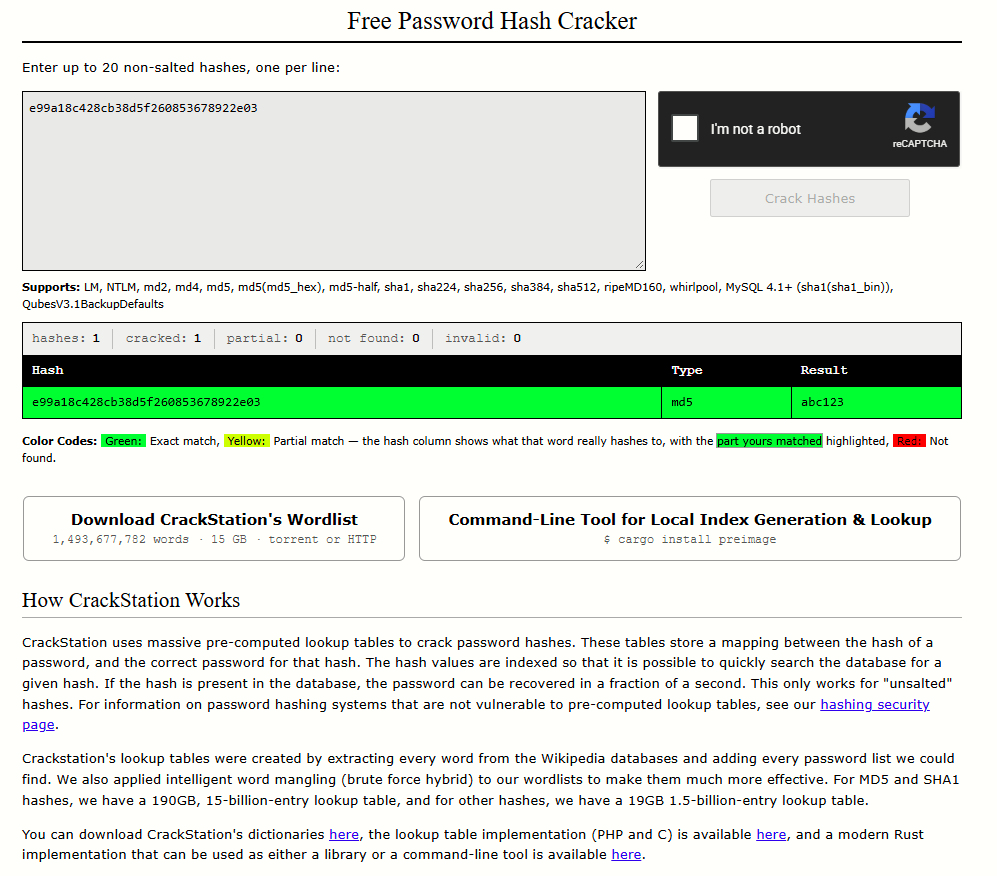
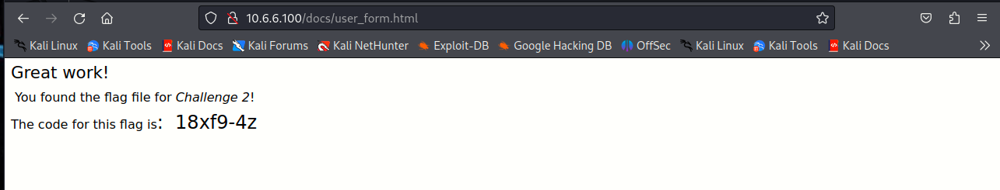
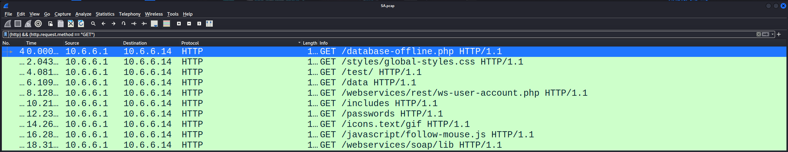

# Challenge 1: SQL Injection

We are tasked to discover user account information on a server and crack the password of **Gordon Brown's** account. We will then locate the file that contains the Challenge 1 code and use **Gordon Brown's** account credentials to open the file at 172.17.0.2 to view its contents.

## Step 1 and Step 2: Setup and Retrieve Credentials
From the [Findings](../attacks-and-exploitation.md#findings) section in the [attacks-and-exploitation](../attacks-and-exploitation.md), we have seen that the password hash of Gordon Brown's account is `e99a18c428cb38d5f260853678922e03`


## Step 3: Cracking Gordon Brown's Account Password

As we see below, the password for that hash is abc123



## Step 4: Find the Flag.
The question didn't specify which service I should try to log in. I have tried the HTTP service but didn't work, then performed an `namp` scan to check what services are available in that host (`172.17.0.2`). At the end I figured out that it was SSH

```
┌──(kali㉿Kali)-[~]
└─$ nmap 172.17.0.2 
Starting Nmap 7.94 ( https://nmap.org ) at 2026-09-12 10:24 UTC
Nmap scan report for metasploitable.vm (172.17.0.2)
Host is up (0.00014s latency).
Not shown: 981 closed tcp ports (conn-refused)
PORT     STATE SERVICE
21/tcp   open  ftp
22/tcp   open  ssh
23/tcp   open  telnet
25/tcp   open  smtp
80/tcp   open  http                                                                                                                                        
111/tcp  open  rpcbind                                                                                                                                     
139/tcp  open  netbios-ssn                                                                                                                                 
445/tcp  open  microsoft-ds                                                                                                                                
512/tcp  open  exec                                                                                                                                        
513/tcp  open  login                                                                                                                                       
514/tcp  open  shell                                                                                                                                       
1099/tcp open  rmiregistry                                                                                                                                 
1524/tcp open  ingreslock                                                                                                                                  
2121/tcp open  ccproxy-ftp                                                                                                                                 
3306/tcp open  mysql                                                                                                                                       
5432/tcp open  postgresql                                                                                                                                  
6667/tcp open  irc                                                                                                                                         
8009/tcp open  ajp13                                                                                                                                       
8180/tcp open  unknown     
Nmap done: 1 IP address (1 host up) scanned in 0.06 seconds     
┌──(kali㉿Kali)-[~]                                                                                                                                        
└─$ ssh gordonb@172.17.0.2
The authenticity of host '172.17.0.2 (172.17.0.2)' can't be established.                                                                                   
DSA key fingerprint is SHA256:kgTW5p1Amzh5MfHn9jIpZf2/pCIZq2TNrG9sh+fy95Q.                                                                                 
This key is not known by any other names.                                                                                                                  
Are you sure you want to continue connecting (yes/no/[fingerprint])? yes                                                                                   
Warning: Permanently added '172.17.0.2' (DSA) to the list of known hosts.                                                                                  
gordonb@172.17.0.2's password:                                                                                                                             
Linux 32554753bfe5 4.13.0-21-generic #24-Ubuntu SMP Mon Dec 18 17:29:16 UTC 2017 x86_64 
The programs included with the Ubuntu system are free software;                                                                                            
the exact distribution terms for each program are described in the                                                                                         
individual files in /usr/share/doc/*/copyright.
Ubuntu comes with ABSOLUTELY NO WARRANTY, to the extent permitted by                                                                                       
applicable law.    
To access official Ubuntu documentation, please visit:                                                                                                     
http://help.ubuntu.com/
gordonb@metasploitable:~$ ls
hkxisx.txt
gordonb@metasploitable:~$ cat hkxisx.txt 
Congratulations!  
You found the flag for Challenge 1!  
The code for this challenge is 4E9f12.
gordonb@metasploitable:~$ 
```

## Step 5: SQL Injection Remediation.

1. Using prepared statements
2. Sanitization: Input checking, field validation, and filtering user inputs
3. Using stored safe Procedures
4. Using ORMs (Hibernate, Entity Framework, etc.) generate parameterized queries by default, though raw query methods in ORMs can still be misused.
# Challenge 2: Web Server Vulnerabilities

## Step 1 and Step 2: Setup and Recon
After setting the security to low, I run a simple `nmap` script `http-enum` which revealed hidden the directories mentioned in the question file

```
┌──(kali㉿Kali)-[~]
└─$ nmap -p80 -sV 10.6.6.100 --script=http-enum
Starting Nmap 7.94 ( https://nmap.org ) at 2026-09-12 10:51 UTC
Nmap scan report for 10.6.6.100
Host is up (0.00011s latency).

PORT   STATE SERVICE VERSION
80/tcp open  http    Apache httpd 2.4.10 ((Debian))
|_http-server-header: Apache/2.4.10 (Debian)
| http-enum: 
|   /login.php: Possible admin folder
|   /robots.txt: Robots file
|   /config/: Potentially interesting directory w/ listing on 'apache/2.4.10 (debian)'
|   /docs/: Potentially interesting directory w/ listing on 'apache/2.4.10 (debian)'
|_  /external/: Potentially interesting directory w/ listing on 'apache/2.4.10 (debian)'

Service detection performed. Please report any incorrect results at https://nmap.org/submit/ .
Nmap done: 1 IP address (1 host up) scanned in 12.22 seconds

┌──(kali㉿Kali)-[~]
└─$ 

```
## Step 3: Finding the Flag

The flag was in user_form.htm under the /docs directory as shown below:



## Step 4: Directory Listing Remediation

**Directory Listing** occurs when a web server automatically displays a folder's contents because no default file (like `index.html`) is present.

- **Default Index File:** Place an empty `index.html` or `index.php` file in sensitive directories as a fallback defense-in-depth measure.
- **Restrict File Access:** Ensure direct web access is restricted for non-public assets (such as `.env`, `.git`, logs, and database backups). Move private folders outside the web server root directory (`public_html` / `www`).

# Challenge 3: Exploit open SMB Server Shares

## Step 1: Enumerating SMB servers

```
┌──(kali㉿Kali)-[~]
└─$ nmap 10.6.6.0/24  -p139,445 --open                                                                                                                     
Starting Nmap 7.94 ( https://nmap.org ) at 2026-09-12 14:30 UTC
Nmap scan report for gravemind.vm (10.6.6.23)
Host is up (0.00025s latency).

PORT    STATE SERVICE
139/tcp open  netbios-ssn
445/tcp open  microsoft-ds

Nmap done: 256 IP addresses (7 hosts up) scanned in 8.06 seconds

┌──(kali㉿Kali)-[~]
└─$    
```

From the output above, we see that `gravemind.vm` is the only host that runs SMB service.

## Step 2: Determining which SMB directories can be accessed by anonymous users.

```
┌──(kali㉿Kali)-[~]
└─$ smbclient -L  //10.6.6.23/
Password for [WORKGROUP\kali]:
Anonymous login successful

        Sharename       Type      Comment
        ---------       ----      -------
        homes           Disk      All home directories
        workfiles       Disk      Confidential Workfiles
        print$          Disk      Printer Drivers
        IPC$            IPC       IPC Service (Samba 4.9.5-Debian)
Reconnecting with SMB1 for workgroup listing.
Anonymous login successful

        Server               Comment
        ---------            -------
        Workgroup            Master
        ---------            -------

┌──(kali㉿Kali)-[~]
└─$ smbclient   //10.6.6.23/homes                     
Password for [WORKGROUP\kali]:
Anonymous login successful
tree connect failed: NT_STATUS_BAD_NETWORK_NAME

┌──(kali㉿Kali)-[~]
└─$ smbclient   //10.6.6.23/workfiles
Password for [WORKGROUP\kali]:
Anonymous login successful
Try "help" to get a list of possible commands.
smb: \>           
smb: \> ^C

┌──(kali㉿Kali)-[~]
└─$ smbclient   //10.6.6.23/print$
Password for [WORKGROUP\kali]:
Anonymous login successful
Try "help" to get a list of possible commands.
smb: \> ^C

┌──(kali㉿Kali)-[~]
└─$ smbclient   //10.6.6.23/IPC$
Password for [WORKGROUP\kali]:
Anonymous login successful
Try "help" to get a list of possible commands.
smb: \> 
smb: \> 
smb: \> ^C

┌──(kali㉿Kali)-[~]
└─$                                            
```

we see that  `workfiles, print$, IPC$` are accessible by anonymous users. The home isn't a real share, it is just used to route users into their specific home directory.

## Step 3: Finding the Flag

The flag has been found in the `print$` directory as shown below:

```
┌──(kali㉿Kali)-[~]
└─$ smbclient //10.6.6.23/print$                                                      
Password for [WORKGROUP\kali]:
Anonymous login successful
Try "help" to get a list of possible commands.
smb: \> ls
  .                                   D        0  Mon Aug 14 09:40:01 2023
  ..                                  D        0  Mon Aug 30 05:00:05 2021
  IA64                                D        0  Mon Sep  2 13:39:42 2019
  x64                                 D        0  Mon Aug 30 05:00:05 2021
  W32X86                              D        0  Mon Aug 30 05:00:05 2021
  W32MIPS                             D        0  Mon Sep  2 13:39:42 2019
  W32ALPHA                            D        0  Mon Sep  2 13:39:42 2019
  COLOR                               D        0  Mon Sep  2 13:39:42 2019
  W32PPC                              D        0  Mon Sep  2 13:39:42 2019
  WIN40                               D        0  Mon Sep  2 13:39:42 2019
  OTHER                               D        0  Tue Aug 10 00:00:00 2021
  color                               D        0  Mon Aug 30 05:00:05 2021

                38497656 blocks of size 1024. 7096212 blocks available
smb: \> cd Other
smb: \Other\> ls
  .                                   D        0  Tue Aug 10 00:00:00 2021
  ..                                  D        0  Mon Aug 14 09:40:01 2023
  taxes.txt                           N      103  Wed Sep  1 00:00:00 2021

                38497656 blocks of size 1024. 7096204 blocks available
smb: \Other\> get taxes.txt
getting file \Other\taxes.txt of size 103 as taxes.txt (100.6 KiloBytes/sec) (average 100.6 KiloBytes/sec)
smb: \Other\> ^C

┌──(kali㉿Kali)-[~]
└─$ cat taxes.txt 
Congratulations!  
You found the flag for Challenge 3!  
The code for this challenge is A9!15wa2.

┌──(kali㉿Kali)-[~]
└─$      
```

## Step 4: SMB Attack Remediation

- Disabling anonymouse login
- Updating and patching the service to last version
- Use strong authentication
- Blocking SMB using the firewall from external hosts

# Challenge 4: Analyze a PCAP File to Find Information
## Step 1: Analyzing the File



From the image above (I applied a filter to show only important packets in this step) we see that the IP of the target is `10.6.6.14`. many endpoints have been found and are very clear under the info section in the image:
- `/database-offline.php` (Root `/`)
- `/styles/global-styles.css`
- `/test/
- `/data
- `/webservices/rest/ws-user-account.php`
- `/includes`
- `/passwords
- `/icons.text/gif
- `/javascript/follow-mouse.js
- `/webservices/soap/lib`
## Step 2: LAB PROBLEM
Attempted to access the target web server (`10.6.6.14`) via a web browser to locate the Challenge 4 flag (`[http://10.6.6.14/data/accounts.xml](http://10.6.6.14/data/accounts.xml)`). However, the web service was unreachable.

An Nmap service scan confirmed that port 80 (HTTP) was closed, leaving only port 3306 (MySQL) active on the host:

```
┌──(kali㉿Kali)-[~]
└─$ nmap 10.6.6.14 -sV
Starting Nmap 7.94 ( https://nmap.org ) at 2026-09-12 15:17 UTC
Nmap scan report for mutillidae.vm (10.6.6.14)
Host is up (0.00010s latency).
Not shown: 999 closed tcp ports (conn-refused)
PORT     STATE SERVICE VERSION
3306/tcp open  mysql   MySQL 5.5.60-0ubuntu0.14.04.1

Service detection performed. Please report any incorrect results at https://nmap.org/submit/ .
Nmap done: 1 IP address (1 host up) scanned in 8.22 seconds
```

Because the HTTP service was inactive on the lab virtual machine, live browser verification could not be completed, and analysis was limited to the captured PCAP artifact.
## Step 3: Remediation of cleartext Transmiting 
- Use TLS encryption always. For HTTP it is HTTPS.
- If TLS isn't supported in the protocol, find another form for encyrption.
