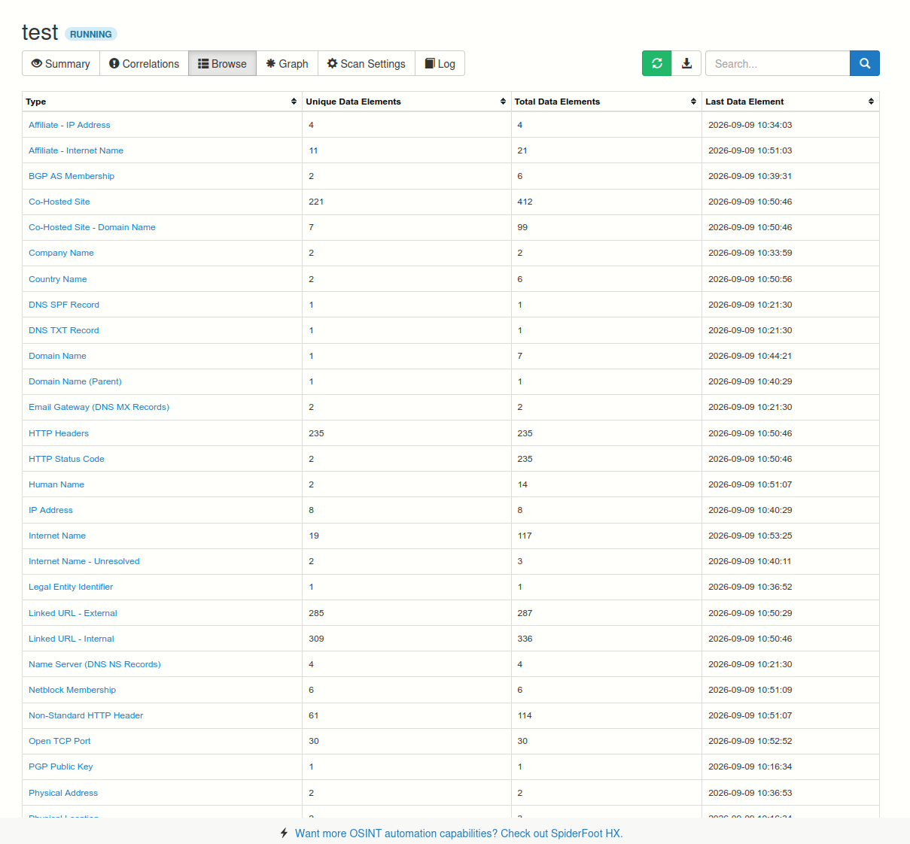
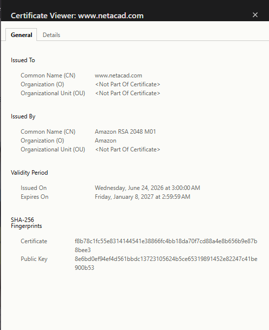
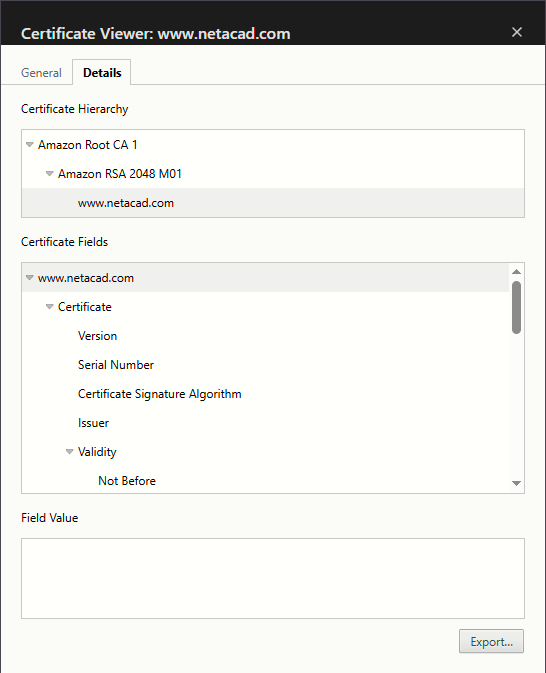
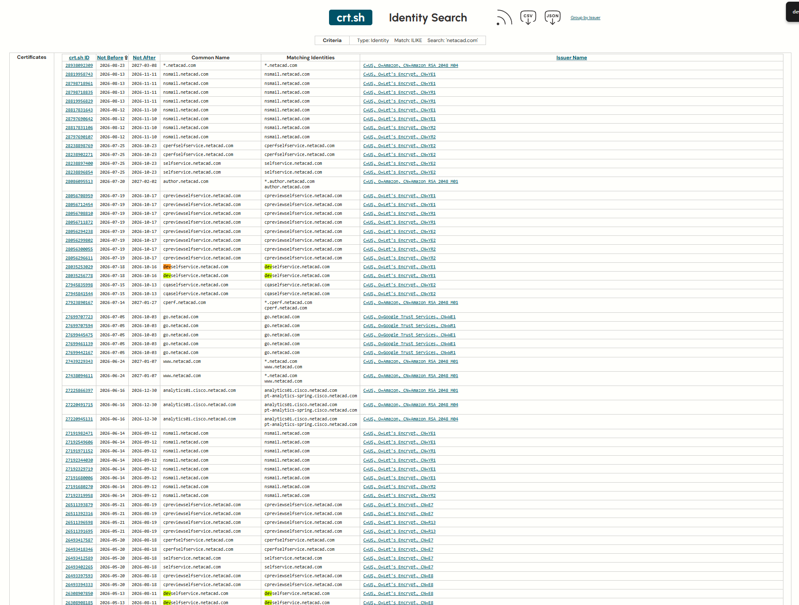
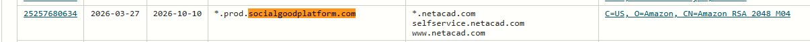
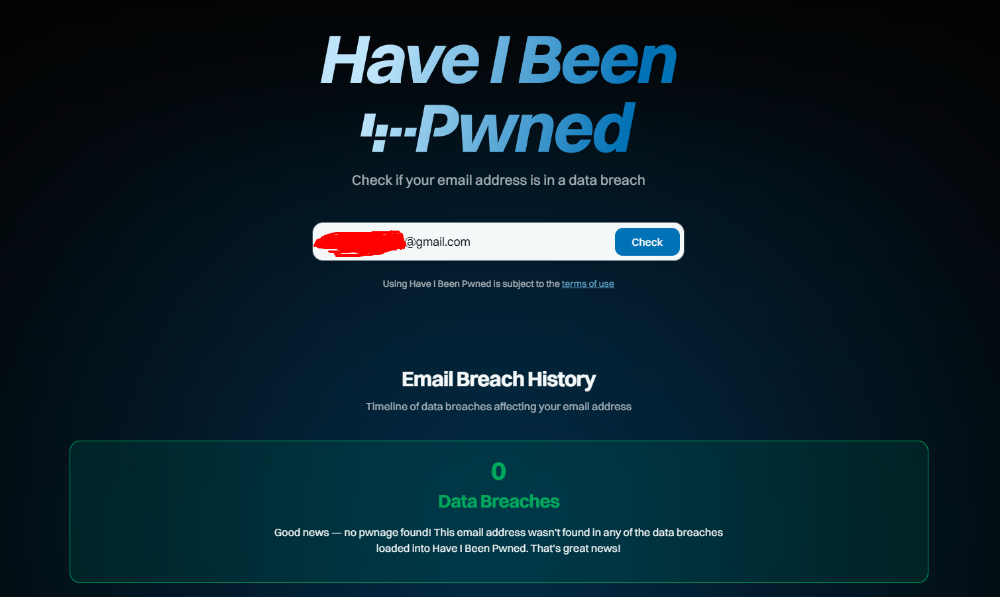
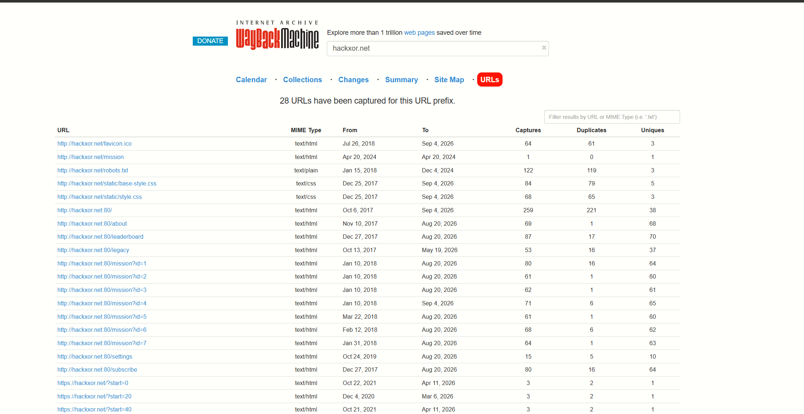
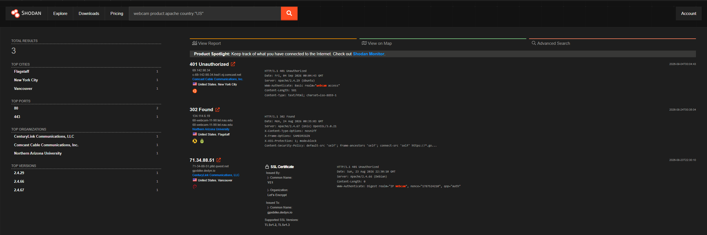
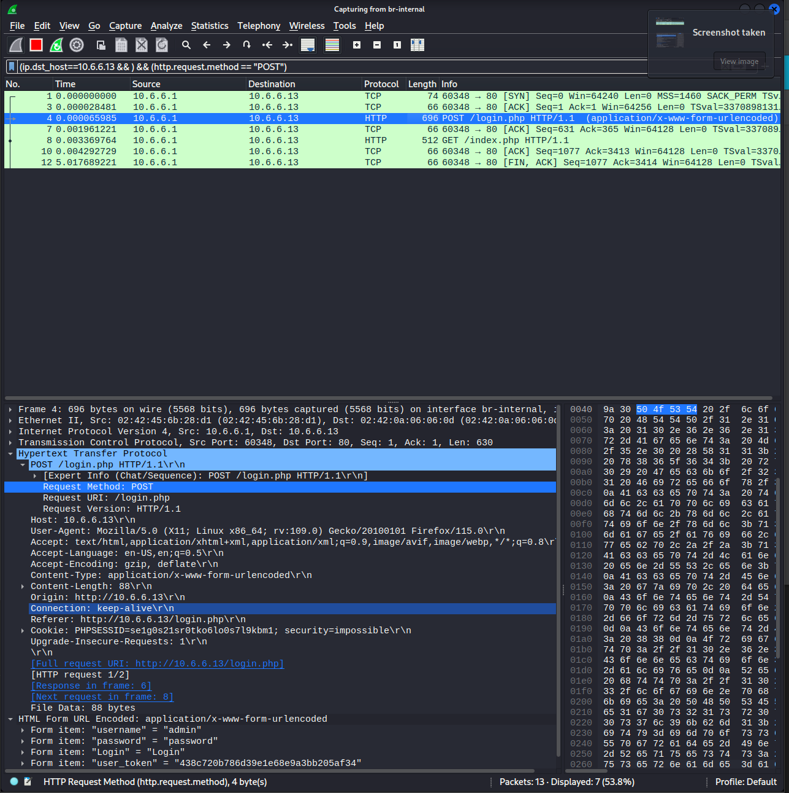

# Passive Reconnaissance: Note

>  All commands were run in the course Kali VM against lab-sanctioned targets (`h4cker.org`, `hackxor.net`, `cisco.com`, `netacad.com`). 
>  The customized distribution used in conducting tests in this write-up is available at [Ethical Hacker Kali Linux](https://www.netacad.com/resources/lab-downloads?courseLang=en-US)
>   
---

## TL;DR; Tool Index

| Phase           | Tool                    | One-liner                                       | What it gives you                                   |
| --------------- | ----------------------- | ----------------------------------------------- | --------------------------------------------------- |
| Footprinting    | OSINT Framework         | `https://osintframework.com/`                   | Visual tree of OSINT tool categories                |
| Footprinting    | WhatsMyName             | `https://whatsmyname.app/`                      | Username → account enumeration across 200+ sites    |
| Footprinting    | SpiderFoot              | `spiderfoot -l 127.0.0.1:5001`                  | Automated OSINT scanner, 200+ modules, GUI + CLI    |
| Footprinting    | Recon-ng                | `recon-ng` → `marketplace install …`            | Modular Metasploit-style OSINT framework            |
| DNS             | nslookup                | `nslookup cisco.com`                            | Resolve A / AAAA / NS / MX / TXT                    |
| DNS             | whois                   | `whois 72.163.5.201`                            | Registrar + IP block ownership                      |
| DNS             | dig                     | `dig cisco.com @8.8.8.8 ns`                     | Cleaner DNS queries, scriptable                     |
| DNS             | host                    | `host 72.163.10.1`                              | Minimal rDNS / forward lookup                       |
| SSL             | Browser padlock         | -                                               | Live cert details (issuer, expiry, SAN)             |
| SSL             | crt.sh                  | `https://crt.sh/?q=netacad.com`                 | Certificate Transparency log search                 |
| Org / Breach    | HaveIBeenPwned          | `https://haveibeenpwned.com/`                   | Email / domain breach lookup                        |
| Org / Breach    | EmailHarvester          | `emailharvester -d h4cker.org`                  | Scrape emails for a domain                          |
| Org / Breach    | SpiderFoot (email scan) | `spiderfoot -l 127.0.0.1:5001`                  | Account / breach / leak correlation                 |
| Metadata        | ExifTool                | `exiftool -csv > out.csv <dir>`                 | Strip / read file metadata                          |
| Archive         | Wayback Machine         | `https://web.archive.org/`                      | Historical site snapshots, URLs, file types         |
| Exposed devices | Shodan                  | `shodan init <KEY>` then `shodan search webcam` | Search engine for internet-connected device banners |
| Local traffic   | tcpdump                 | `sudo tcpdump -i eth0 -s 0 -w out.pcap`         | CLI packet sniffer, writes pcap                     |
| Local traffic   | Wireshark               | `wireshark` → open pcap                         | GUI pcap analyzer: filters, string search, decode   |

---

## 1. Footprinting: OSINT Platforms

The first phase of any engagement for me is mapping the digital footprint without ever touching the target. These are the four platforms I reach for first.

### OSINT Framework && WhatsMyName

#### Purpose 
Discovery layer. The OSINT Framework (`osintframework.com`) is a tree that tells me what *category* of tool exists for a given data type (username, email, domain, etc.). WhatsMyName (`whatsmyname.app`) takes a username and tells me where that identity is registered across 200+ sites.

Both are web GUIs. Workflow I use:

1. Start at OSINT Framework, drill into the data type I need (e.g. *Username → Username Search Engines*).
2. Land on WhatsMyName, paste 3–5 candidate usernames (one per line), click the green magnifier.





#### Findings 
From the lab run: WhatsMyName returns a sortable table of confirmed accounts, with CSV/PDF export for the report. The value of this is twofold; it identifies accounts tied to enterprise personnel (which may be on vulnerable third-party sites) and it reveals personal interests / locations that are useful for social-engineering pretexts.
#### Remediation 
For defenders: training personnel to use separate, non-identifying usernames for personal vs. work accounts; monitoring WhatsMyName output for executive identities; MFA on every account that surfaces.
#### Gotchas 
OSINT Framework is partially stale; some links 404. WhatsMyName only *confirms* an account exists, not that it's the right person (false positives on common handles). 
### SpiderFoot
#### Purpose Automated OSINT scanner. SpiderFoot seeds from a domain, IP, subnet, ASN, email, phone, or name and queries 200+ data sources, presenting results in a GUI. Four scan use cases: `All` (everything, slow, may be active), `Footprint` (perimeter + identities via web crawling), `Investigate` (adds blacklist / malicious-reputation sources), `Passive` (no target contact).

#### Usage
```bash
spiderfoot -l 127.0.0.1:5001            # start GUI server
spiderfoot -M | grep <term>              # list modules by keyword
spiderfoot -h                            # CLI options
```
In the GUI: **New Scan → target `h4cker.org` → use case `Footprint → Run Scan Now**. For module-only scans: **By Module** tab, tick only the modules I have API keys for.

#### Findings
Sample SpiderFoot modules that were useful in the lab:

| Information type | Module | API key? |
|---|---|---|
| Accounts associated with a domain | `sfp_accounts` | No |
| Cross-referenced links | `sfp_crossref` | No |
| Email addresses | `sfp_emailcrawlr` | Yes (free tier) |
| Domains / URLs in code | `sfp_grep_app` | Yes (free tier) |
| Geolocation | `sfp_ipapicom` | Yes (free tier) |
| Breach data | `sfp_intellx` (IntelligenceX) | Yes (free tier) |

Running an API-only scan against `h4cker.org` returned Leak Site URLs in the results table; the contributing module was `sfp_intellx`. Double-clicking a row and opening it in a new tab showed the original leaked information.
#### Remediation
For defenders: assume your org *will* show up in SpiderFoot. Subscribe to breach-monitoring (HaveIBeenPwned domain alerts, IntelligenceX), strip metadata from public files (see ExifTool section), and audit Certificate Transparency logs (see crt.sh section) for unauthorized cert issuance; that's how you detect someone *else* scanning you.

#### Gotchas 
The `All` use case may issue active probes; don't use it without authorization. API-keyed modules silently return nothing if the key is missing or rate-limited. Full scans take hours; give a real engagement scan at least 30 minutes before browsing.

### Recon-ng
#### Purpose 
Modular OSINT framework, Metasploit-shaped. Each module is a Python program in a marketplace. options are set per-module and stored in a workspace so re-running is one command.

#### Usage
```text
recon-ng                          # enter framework
[recon-ng] > workspaces create test
[recon-ng][test] > marketplace search
[recon-ng][test] > marketplace install recon/domains-hosts/bing_domain_web
[recon-ng][test] > modules load hackertarget
[recon-ng][test][hackertarget] > options set source hackxor.net
[recon-ng][test][hackertarget] > run
[recon-ng][test] > dashboard     # summary of collected data
[recon-ng][test] > show hosts     # list discovered hosts
[recon-ng][test] > back           # exit module
```

#### Findings 
```
[recon-ng][default] > marketplace search hackertarge

[*] Searching module index for 'hackertarge'...
  +---------------------------------------------------------------------------------+
  |               Path               | Version |     Status    |  Updated   | D | K |
  +---------------------------------------------------------------------------------+
  | recon/domains-hosts/hackertarget | 1.1     | not installed | 2020-05-17 |   |   |
  +---------------------------------------------------------------------------------+
  D = Has dependencies. See info for details.
  K = Requires keys. See info for details.

[recon-ng][default] > marketplace install recon/domains-hosts/hackertarget

[*] Module installed: recon/domains-hosts/hackertarget
[*] Reloading modules...

[recon-ng][default] > modules
load    reload  search

[recon-ng][default] > modules
load    reload  search

[recon-ng][default] > modules load hackert

[recon-ng][default][hackertarget] > info
  Name: HackerTarget Lookup
Author: Michael Henriksen (@michenriksen)
Version: 1.1

Description:
  Uses the HackerTarget.com API to find host names. Updates the 'hosts' table with the results.

Options:
  Name    Current Value  Required  Description
  ------  -------------  --------  -----------
  SOURCE  default        yes       source of input (see 'info' for details)

Source Options:
  default        SELECT DISTINCT domain FROM domains WHERE domain IS NOT NULL
  <string>       string representing a single input
  <path>         path to a file containing a list of inputs
  query <sql>    database query returning one column of inputs

[recon-ng][default][hackertarget] > options set SOURCE hackxor.net
SOURCE => hackxor.net

[recon-ng][default][hackertarget] > run
HACKXOR.NET
[*] Country: None
[*] Host: analytics.hackxor.net
[*] Ip_Address: 138.68.117.124
[*] Latitude: None
[*] Longitude: None
[*] Notes: None
[*] Region: None
[*] --------------------------------------------------
[*] Country: None
[*] Host: dreaded.hackxor.net
[*] Ip_Address: 138.68.117.124
[*] Latitude: None
[*] Longitude: None
[*] Notes: None
[*] Region: None
[*] --------------------------------------------------
[*] Country: None
[*] Host: hkrb.hackxor.net
[*] Ip_Address: 138.68.117.124
[*] Latitude: None
[*] Longitude: None
[*] Notes: None
[*] Region: None
[*] --------------------------------------------------
[*] Country: None
[*] Host: hmrc.hackxor.net
[*] Ip_Address: 138.68.117.124
[*] Latitude: None
[*] Longitude: None
[*] Notes: None
[*] Region: None
[*] --------------------------------------------------
[*] Country: None
[*] Host: intranet.hackxor.net
[*] Ip_Address: 10.60.10.18
[*] Latitude: None
[*] Longitude: None
[*] Notes: None
[*] Region: None
[*] --------------------------------------------------
[*] Country: None
[*] Host: phonecorp.hackxor.net
[*] Ip_Address: 138.68.117.124
[*] Latitude: None
[*] Longitude: None
[*] Notes: None
[*] Region: None
[*] --------------------------------------------------
[*] Country: None
[*] Host: research1.hackxor.net
[*] Ip_Address: 138.68.117.124
[*] Latitude: None
[*] Longitude: None
[*] Notes: None
[*] Region: None
[*] --------------------------------------------------
[*] Country: None
[*] Host: transparency.hackxor.net
[*] Ip_Address: 138.68.117.124
[*] Latitude: None
[*] Longitude: None
[*] Notes: None
[*] Region: None
[*] --------------------------------------------------
[*] Country: None
[*] Host: transperncy.hackxor.net
[*] Ip_Address: 138.68.117.124
[*] Latitude: None
[*] Longitude: None
[*] Notes: None
[*] Region: None
[*] --------------------------------------------------
SUMMARY
[*] 9 total (9 new) hosts found.

[recon-ng][default][hackertarget] >
```

With the `hackertarget` module against `hackxor.net`, Recon-ng discovered 9 subdomains and stored them in the workspace DB under the data label `hosts` (shown by `dashboard` and `show hosts`). The `bing_domain_web` module found a comparable count (≈6 at time of lab). The `interesting_files` module (`discovery/info_disclosure/interesting_files`) writes a CSV of discovered files into `recon-ng/data/`. Workspaces isolate engagements; each preserves its installed modules, configured options, and result set, which is exactly what I want for a multi-customer pentest.

#### Remediation 
Recon-ng finds nothing the target hasn't published. The defensive lesson is to audit what's externally enumerable: subdomain inventory, exposed files (`.bak`, `.config`, `.csv`), and predictable hostnames. Run `bing_domain_web` and `hackertarget` against your own domain quarterly.

#### Gotchas 
Fresh Recon-ng ships with **zero** modules installed; `modules search` returns empty until you `marketplace install`. Shodan modules require dependencies (D column) *and* API keys (K column). `bing_domain_web` results vary widely with the search engine's current index; sometimes returns 0. Use `recon-web` for a browser view of the DB and easy CSV export.

---

## 2. DNS Reconnaissance

DNS is the cheapest, lowest-risk intel source in passive recon; the target's own name servers hand it to you.
### nslookup
#### Purpose 
Resolve names → IPs and enumerate DNS record types (A, AAAA, NS, MX, TXT, ANY). Available on every OS.
#### Usage
```bash
nslookup cisco.com              # one-shot A + AAAA
nslookup                        # interactive
> set type=ns                   # name servers
> set type=mx                   # mail exchangers
> set type=any                  # everything (often truncated via UDP)
> server 8.8.8.8                # use Google DNS
> cisco.com
> exit
nslookup netacad.com 8.8.8.8    # one-shot with custom server
```

#### Findings 
```
┌──(kali㉿Kali)-[~]
└─$ nslookup cisco.com
Server:         1.1.1.1
Address:        1.1.1.1#53

Non-authoritative answer:
Name:   cisco.com
Address: 72.163.4.185
Name:   cisco.com
Address: 2001:420:1101:1::185


┌──(kali㉿Kali)-[~]
└─$ nslookup 
> set type=any
> cisco.com
;; Connection to 1.1.1.1#53(1.1.1.1) for cisco.com failed: timed out.
Server:         1.1.1.1
Address:        1.1.1.1#53

** server can't find cisco.com: NOTIMP
> set type=mx
> cisco.com
;; communications error to 1.1.1.1#53: timed out
Server:         1.1.1.1
Address:        1.1.1.1#53

Non-authoritative answer:
cisco.com       mail exchanger = 30 aer-mx-01.cisco.com.
cisco.com       mail exchanger = 20 rcdn-mx-01.cisco.com.
cisco.com       mail exchanger = 10 alln-mx-01.cisco.com.

Authoritative answers can be found from:
> set type=nx
unknown query type: nx
> set type=ns
> cisco.com
;; communications error to 1.1.1.1#53: timed out
Server:         1.1.1.1
Address:        1.1.1.1#53

Non-authoritative answer:
cisco.com       nameserver = a28-64.akam.net.
cisco.com       nameserver = ns2.cisco.com.
cisco.com       nameserver = ns3.cisco.com.
cisco.com       nameserver = a3-64.akam.net.
cisco.com       nameserver = ns1.cisco.com.

Authoritative answers can be found from:
> exit

┌──(kali㉿Kali)-[~]
└─$
```

Against `cisco.com`: A record returned `72.163.4.185`, AAAA returned `2001:420:1101:1::185`. NS records returned `ns1/2/3.cisco.com`, with `ns1` at IPv4 `72.163.5.201` and IPv6 `2001:420:1101:6::a`. Running `set type=any` against `netacad.com` didn't return results because Cloudflare's public DNS server explicitly disables support for traditional `ANY` requests.

#### Remediation 
Don't expose more DNS than needed. TXT records for sensitive tokens (verification strings are fine, but `google-site-verification=` should not be tied to a stale admin account).
#### Gotchas 
`set type=any` is often truncated over UDP; use `dig any` for the full answer. Default server is whatever `/etc/resolv.conf` says; if it's an internal resolver it may give private IPs that don't match the public view.
### whois
#### Purpose 
Queries the registrar / RIR, not the DNS server. Tells me who owns a domain or IP block, contact info (sometimes), and registration history.
#### Usage
```bash
whois cisco.com                # domain registration
whois 72.163.5.201             # IP ownership / netrange
```
#### Findings
```
   Domain Name: CISCO.COM
   Registry Domain ID: 4987030_DOMAIN_COM-VRSN
   Registrar WHOIS Server: whois.markmonitor.com
   Registrar URL: http://www.markmonitor.com
   Updated Date: 2026-04-13T09:54:02Z
   Creation Date: 1987-05-14T04:00:00Z
   Registry Expiry Date: 2027-05-15T04:00:00Z
   Registrar: MarkMonitor Inc.
   Registrar IANA ID: 292
   Registrar Abuse Contact Email: abusecomplaints@markmonitor.com
   Registrar Abuse Contact Phone: +1.2086851750
   Domain Status: clientDeleteProhibited https://icann.org/epp#clientDeleteProhibited
   Domain Status: clientTransferProhibited https://icann.org/epp#clientTransferProhibited
   Domain Status: clientUpdateProhibited https://icann.org/epp#clientUpdateProhibited
   Domain Status: serverDeleteProhibited https://icann.org/epp#serverDeleteProhibited
   Domain Status: serverTransferProhibited https://icann.org/epp#serverTransferProhibited
   Domain Status: serverUpdateProhibited https://icann.org/epp#serverUpdateProhibited
   Name Server: A28-64.AKAM.NET
   Name Server: A3-64.AKAM.NET
   Name Server: NS1.CISCO.COM
   Name Server: NS2.CISCO.COM
   Name Server: NS3.CISCO.COM
   DNSSEC: unsigned
   URL of the ICANN Whois Inaccuracy Complaint Form: https://www.icann.org/wicf/
>>> Last update of whois database: 2026-09-09T10:45:49Z <<<

For more information on Whois status codes, please visit https://icann.org/epp

NOTICE: The expiration date displayed in this record is the date the
registrar's sponsorship of the domain name registration in the registry is
currently set to expire. This date does not necessarily reflect the expiration
date of the domain name registrant's agreement with the sponsoring
registrar.  Users may consult the sponsoring registrar's Whois database to
view the registrar's reported date of expiration for this registration.

TERMS OF USE: You are not authorized to access or query our Whois
database through the use of electronic processes that are high-volume and
automated except as reasonably necessary to register domain names or
modify existing registrations; the Data in VeriSign Global Registry
Services' ("VeriSign") Whois database is provided by VeriSign for
information purposes only, and to assist persons in obtaining information
about or related to a domain name registration record. VeriSign does not
guarantee its accuracy. By submitting a Whois query, you agree to abide
by the following terms of use: You agree that you may use this Data only
for lawful purposes and that under no circumstances will you use this Data
to: (1) allow, enable, or otherwise support the transmission of mass
unsolicited, commercial advertising or solicitations via e-mail, telephone,
or facsimile; or (2) enable high volume, automated, electronic processes
that apply to VeriSign (or its computer systems). The compilation,
repackaging, dissemination or other use of this Data is expressly
prohibited without the prior written consent of VeriSign. You agree not to
use electronic processes that are automated and high-volume to access or
query the Whois database except as reasonably necessary to register
domain names or modify existing registrations. VeriSign reserves the right
to restrict your access to the Whois database in its sole discretion to ensure
operational stability.  VeriSign may restrict or terminate your access to the
Whois database for failure to abide by these terms of use. VeriSign
reserves the right to modify these terms at any time.

The Registry database contains ONLY .COM, .NET, .EDU domains and
Registrars.
Domain Name: cisco.com
Registry Domain ID: 4987030_DOMAIN_COM-VRSN
Registrar WHOIS Server: whois.markmonitor.com
Registrar URL: http://www.markmonitor.com
Updated Date: 2026-04-13T09:54:02+0000
Creation Date: 1987-05-14T04:00:00+0000
Registrar Registration Expiration Date: 2027-05-15T00:00:00+0000
Registrar: MarkMonitor, Inc.
Registrar IANA ID: 292
Registrar Abuse Contact: https://corp.markmonitor.com/domain/ui/abuse-report
Registrar Abuse Contact Phone: +1.2086851750
Domain Status: clientUpdateProhibited (https://www.icann.org/epp#clientUpdateProhibited)
Domain Status: clientTransferProhibited (https://www.icann.org/epp#clientTransferProhibited)
Domain Status: clientDeleteProhibited (https://www.icann.org/epp#clientDeleteProhibited)
Domain Status: serverUpdateProhibited (https://www.icann.org/epp#serverUpdateProhibited)
Domain Status: serverTransferProhibited (https://www.icann.org/epp#serverTransferProhibited)
Domain Status: serverDeleteProhibited (https://www.icann.org/epp#serverDeleteProhibited)
Registrant Name: Domain Administrator
Registrant Organization:  Cisco Technology Inc.
Registrant Street: 170 W. Tasman Dr.
Registrant City: San Jose
Registrant State/Province: CA
Registrant Postal Code: 95134
Registrant Country: US
Registrant Phone: +1.4085273842
Registrant Phone Ext: 
Registrant Fax: +1.4085264575
Registrant Fax Ext: 
Registrant Email: infosec@cisco.com
Tech Name: Domain Administrator
Tech Phone: +1.4085273842
Tech Email: infosec@cisco.com
Name Server: a28-64.akam.net
Name Server: ns1.cisco.com
Name Server: a3-64.akam.net
Name Server: ns2.cisco.com
Name Server: ns3.cisco.com
DNSSEC: unsigned
URL of the ICANN WHOIS Data Problem Reporting System: http://wdprs.internic.net/
>>> Last update of WHOIS database: 2026-09-09T10:44:24+0000 <<<

For more information on WHOIS status codes, please visit:
  https://www.icann.org/resources/pages/epp-status-codes

If you wish to contact this domain’s Registrant or Technical
contact, and such email address is not visible above, you may do so via our web
form, pursuant to ICANN’s Temporary Specification. To verify that you are not a
robot, please enter your email address to receive a link to a page that
facilitates email communication with the relevant contact(s).

Web-based WHOIS:
  https://domains.markmonitor.com/whois/contact/cisco.com

If you have a legitimate interest in viewing the non-public WHOIS details, send
your request and the reasons for your request to whoisrequest@markmonitor.com
and specify the domain name in the subject line. We will review that request and
may ask for supporting documentation and explanation.

The data in MarkMonitor’s WHOIS database is provided for information purposes,
and to assist persons in obtaining information about or related to a domain
name’s registration record. While MarkMonitor believes the data to be accurate,
the data is provided "as is" with no guarantee or warranties regarding its
accuracy.

By submitting a WHOIS query, you agree that you will use this data only for
lawful purposes and that, under no circumstances will you use this data to:
  (1) allow, enable, or otherwise support the transmission by email, telephone,
or facsimile of mass, unsolicited, commercial advertising, or spam; or
  (2) enable high volume, automated, or electronic processes that send queries,
data, or email to MarkMonitor (or its systems) or the domain name contacts (or
its systems).

MarkMonitor reserves the right to modify these terms at any time.

By submitting this query, you agree to abide by this policy.

MarkMonitor Domain Management(TM)
Protecting companies and consumers in a digital world.

Visit MarkMonitor at https://www.markmonitor.com
Contact us at +1.8007459229
In Europe, at +44.02032062220
----

```
`whois cisco.com` and `whois netacad.com` both resolve to Cisco Systems; both are Cisco-owned and cloud-hosted. Querying `72.163.5.201` returns ARIN record `CISCO-GEN-7`, NetRange `72.163.0.0 - 72.163.255.255` (CIDR `72.163.0.0/16`), OriginAS `AS109`, registered to Cisco Systems, Inc. at 170 West Tasman Drive, San Jose, CA 95134. Knowing the full /16 is gold; it's the target list for everything else hosted in that block.

#### Remediation Use registrar privacy services for non-essential domains. Keep registrant contact info generic (`hostmaster@`) rather than tying it to a named employee. Audit your IP allocations in ARIN/RIPENCC regularly.

#### Gotchas WHOIS is heavily redacted post-GDPR for `.com`/`.net`; contact details often show the registrar's proxy. Domain WHOIS ≠ IP WHOIS; query the IP separately. Many organizations hide behind cloud providers (CloudFront, Cloudflare); the WHOIS data you see may be Amazon's, not the target's.

### dig

#### Purpose
 Cleaner, scriptable DNS query tool. Default queries A only (vs. nslookup's A + AAAA).

#### Usage
```bash
dig cisco.com                  # default A record
dig cisco.com AAAA             # IPv6
dig cisco.com @8.8.8.8 ns      # NS records via Google DNS
dig netacad.com any            # all record types
dig -x 72.163.5.201            # reverse DNS (PTR)
```
#### Findings 
##### `dig cisco.com`

```
; <<>> DiG 9.18.16-1-Debian <<>> cisco.com
;; global options: +cmd
;; Got answer:
;; ->>HEADER<<- opcode: QUERY, status: NOERROR, id: 19980
;; flags: qr rd ra; QUERY: 1, ANSWER: 1, AUTHORITY: 0, ADDITIONAL: 1

;; OPT PSEUDOSECTION:
; EDNS: version: 0, flags:; udp: 1232
;; QUESTION SECTION:
;cisco.com.			IN	A

;; ANSWER SECTION:
cisco.com.		1778	IN	A	72.163.4.185

;; Query time: 52 msec
;; SERVER: 1.1.1.1#53(1.1.1.1) (UDP)
;; WHEN: Wed Sep 09 11:56:28 UTC 2026
;; MSG SIZE  rcvd: 54

```
##### `dig cisco.com AAAA`

```
; <<>> DiG 9.18.16-1-Debian <<>> cisco.com AAAA
;; global options: +cmd
;; Got answer:
;; ->>HEADER<<- opcode: QUERY, status: NOERROR, id: 17630
;; flags: qr rd ra; QUERY: 1, ANSWER: 1, AUTHORITY: 0, ADDITIONAL: 1

;; OPT PSEUDOSECTION:
; EDNS: version: 0, flags:; udp: 1232
;; QUESTION SECTION:
;cisco.com.			IN	AAAA

;; ANSWER SECTION:
cisco.com.		1659	IN	AAAA	2001:420:1101:1::185

;; Query time: 52 msec
;; SERVER: 1.1.1.1#53(1.1.1.1) (UDP)
;; WHEN: Wed Sep 09 11:57:09 UTC 2026
;; MSG SIZE  rcvd: 66

```
##### `dig cisco.com @8.8.8.8 ns`

```
; <<>> DiG 9.18.16-1-Debian <<>> cisco.com @8.8.8.8 ns
;; global options: +cmd
;; Got answer:
;; ->>HEADER<<- opcode: QUERY, status: NOERROR, id: 38436
;; flags: qr rd ra; QUERY: 1, ANSWER: 5, AUTHORITY: 0, ADDITIONAL: 1

;; OPT PSEUDOSECTION:
; EDNS: version: 0, flags:; udp: 512
;; QUESTION SECTION:
;cisco.com.			IN	NS

;; ANSWER SECTION:
cisco.com.		994	IN	NS	ns2.cisco.com.
cisco.com.		994	IN	NS	a28-64.akam.net.
cisco.com.		994	IN	NS	a3-64.akam.net.
cisco.com.		994	IN	NS	ns3.cisco.com.
cisco.com.		994	IN	NS	ns1.cisco.com.

;; Query time: 124 msec
;; SERVER: 8.8.8.8#53(8.8.8.8) (UDP)
;; WHEN: Wed Sep 09 11:58:17 UTC 2026
;; MSG SIZE  rcvd: 141

```
`dig cisco.com @8.8.8.8 ns` returns `ns1/2/3.cisco.com`.  as `nslookup` did
##### `dig netacad.com any`

```
; <<>> DiG 9.18.16-1-Debian <<>> netacad.com any
;; global options: +cmd
;; Got answer:
;; ->>HEADER<<- opcode: QUERY, status: NOTIMP, id: 834
;; flags: qr rd ra; QUERY: 1, ANSWER: 0, AUTHORITY: 0, ADDITIONAL: 1

;; OPT PSEUDOSECTION:
; EDNS: version: 0, flags:; udp: 1232
; EDE: 21 (Not Supported)
;; QUESTION SECTION:
;netacad.com.			IN	ANY

;; Query time: 8 msec
;; SERVER: 1.1.1.1#53(1.1.1.1) (TCP)
;; WHEN: Wed Sep 09 11:58:37 UTC 2026
;; MSG SIZE  rcvd: 46

```

The `dig any` output is grouped by record type in a tabular ANSWER SECTION, which is far easier to read than nslookup's flat list.
##### `dig -x 72.163.5.201`

```
; <<>> DiG 9.18.16-1-Debian <<>> -x 72.163.5.201
;; global options: +cmd
;; Got answer:
;; ->>HEADER<<- opcode: QUERY, status: NOERROR, id: 64732
;; flags: qr rd ra; QUERY: 1, ANSWER: 1, AUTHORITY: 0, ADDITIONAL: 1

;; OPT PSEUDOSECTION:
; EDNS: version: 0, flags:; udp: 1232
;; QUESTION SECTION:
;201.5.163.72.in-addr.arpa.	IN	PTR

;; ANSWER SECTION:
201.5.163.72.in-addr.arpa. 1800	IN	PTR	ns1.cisco.com.

;; Query time: 400 msec
;; SERVER: 1.1.1.1#53(1.1.1.1) (UDP)
;; WHEN: Wed Sep 09 11:58:49 UTC 2026
;; MSG SIZE  rcvd: 81

```

`dig -x 72.163.5.201` returns a PTR record naming `ns1.cisco.com`. 
`dig -x 72.163.1.1` returns `hsrp-72-163-1-1`; almost certainly the HSRP virtual IP for a default-gateway router on Cisco's internal network. 
#### Remediation 
Don't put device-role hints in DNS names; `hsrp-72-163-1-1.cisco.com` tells me the device type (HSRP router), the subnet (`72.163.1.0/24`), and the role (default gateway) before I've ever touched it. Use generic hostnames and split DNS for internal infrastructure.
#### Gotchas 
`dig any` over UDP is frequently truncated; add `+tcp` or `+dnssec` for the full answer. The `dig` output includes a `;; Query time:` line; useful for timing side-channel work but irrelevant for intel.
### host

#### Purpose
 Minimal lookup; just hostname ↔ IP. No DNS server info, no metadata.
#### Usage
```bash
host 72.163.10.1                       # rDNS
host hsrp-72-163-10-1.cisco.com       # forward
```
#### Findings 
`host` returns only the IP/hostname pair and (if applicable) aliases. Useful in scripts where I want a clean single-line answer; useless for engagement-level recon.

---
## 3. SSL / TLS Certificate Reconnaissance
Certificates are a goldmine because Certificate Transparency logs are public by mandate; every CA must log every cert they issue.

### Browser padlock + cert manager
 

#### Purpose 
Live cert details while browsing: subject, issuer, validity, signature algorithm, SAN list.

#### Usage
Click the padlock in Firefox/Chrome → *Connection secure* → *More info* → *View Certificate*. On Kali, root certs live in `/usr/share/ca-certificates/mozilla/`; on Windows, `certmgr.msc`.
#### Findings 
For `netacad.com` the cert was issued to `socialgoodplatform.com` (CN) by IdenTrust. Expiry date reflected a multi-year cert with PKCS #1 SHA-256 with RSA Encryption as the signature algorithm. The most common root CAs in `/usr/share/ca-certificates/mozilla/` were GlobalSign, DigiCert, and GoDaddy; pricing for a single-domain cert ranges roughly $0–$80/year (varies widely).

#### Remediation 
Use SHA-256 or stronger (never SHA-1, never MD5). Rotate certs before expiry; monitor CT logs (next subsection) for unauthorized issuance. Use ECC where possible for forward-looking deployments.
#### Gotchas 
The padlock only proves encryption, not trustworthiness; a self-signed cert still shows a padlock (with a warning). Stored root certs are attack surface: a compromised CA in your trust store means any site it "signs" is trusted.
### crt.sh

#### Purpose
 Search Certificate Transparency logs for every cert ever issued for a domain; including subdomains the org didn't mean to expose.
#### Usage
Open [crt.sh](https://crt.sh), enter `netacad.com` in the search box. Each row is a cert; click the ID for full details (issuer, SAN list, fingerprint).



#### Findings 
Searching `netacad.com` revealed subdomains starting with `dev` and `stage`; clearly internal dev/staging environments that were cert-issued (and thus CT-logged) by mistake. crt.sh also exposed an affiliated domain: `socialgoodplatform.com`. Searching *that* domain revealed an even larger subdomain tree than `netacad.com` itself; meaning the broader organization has a very large certificate-issued attack surface.

#### Remediation 
Audit CT logs for your domains monthly (crt.sh, CertSpotter, Censys). Issue certs via internal CA for dev/staging environments so they never hit public CT logs. Decommission stale subdomain certs. Consider wildcard certs to reduce exposure volume (controversial; single compromise = total wildcard exposure).

#### Gotchas 
crt.sh is sometimes slow / rate-limited. The IDs are crt.sh-internal only; don't use them in reports as authoritative references. Subdomains visible here may have been torn down; confirm with active recon later.

## 4. Organizational & Breach Reconnaissance

Moving from infrastructure to people. This phase identifies employees, breached credentials, and exposed files.

### HaveIBeenPwned & similar breach databases
#### Purpose 
Check whether an email address or domain has appeared in a known data breach. Sister services: `f-secure.com`, `hacknotice.com`, `breachdirectory.com`, `keepersecurity.com`.

#### Usage
All web GUIs; enter an email or domain, get back a list of breaches.

#### Findings 
My own addresses came back clean (`no`). For domain queries on known orgs, the response was hit-or-miss; open / free APIs surface interesting leads but require painstaking follow-up. Breach data alone is rarely the smoking gun; it's a *lead generator* for credential-stuffing and password-spray lists.


#### Remediation 
For defenders: subscribe to HIBP domain-level alerts (paid tier) so you're notified within hours of an employee email appearing in a new breach. Mandate enterprise SSO + MFA so a leaked password is useless. Ban password reuse via deny-lists (`haveibeenpwned` Pwned Passwords API).

#### Gotchas 
Free tier rate-limits aggressively. Some breach datasets require paid access (Dehashed, IntelligenceX). Many breaches aren't in *any* public DB

### EmailHarvester
#### Purpose Scrape email addresses associated with a domain.

#### Usage
```bash
emailharvester -d h4cker.org                     # scan domain
emailharvester -d h4cker.org -s /path/to/out     # save XML + text output
```
First run prompts to install (`y` + kali password). `-d` is the domain flag, `-s` is the save flag; output goes to `/usr/share/emailharvester/` unless a path is supplied.

#### Findings 
EmailHarvester returned a small set of email addresses for `h4cker.org` and `hackxor.net`. Cross-checking each against HIBP tells me which ones are also in breach datasets; those are the highest-value targets for phishing pretexts and credential-stuffing.

#### Remediation 
Maintain a current inventory of public email addresses for the org. Use role-based addresses (`security@`, `press@`) rather than named-employee addresses for public-facing functions. Audit Google dorks like `site:linkedin.com "@target.com"` to see what's publicly correlatable.

#### Gotchas 
Output location is non-obvious (default `/usr/share/emailharvester/`). Hit rate depends on the target's web presence; small orgs return almost nothing. Pairs well with theHarvester for broader coverage.

### SpiderFoot (email-mode scan)

#### Purpose 
Same SpiderFoot platform, but used in module-selected mode to pivot off a single email address; correlate it against breach databases, social media, code repositories, and link-sharing sites.

#### Usage
Start SpiderFoot, then in **New Scan → By Module** tab select only the email-relevant modules: `Ahmia`, `AccountFinder`, `Archive.org`, `Bing`, `Leak-Lookup`, `CommonCrawl`, `Dehashed`, `DuckDuckGo`, `EmailCrawlr`. Enter the email as the target → **Run Scan Now**.

#### Findings 
Cross-referencing a single email across these modules produced a richer info than EmailHarvester alone; the email was correlated to a code repository handle and a pastebin appearance in one test. This is the bridge between "email exists" and "here's the rest of the identity."

#### Remediation 
Train employees to use distinct identities for code repos vs. work email. Monitor paste sites (pastebin, ghostbin) for org emails via Google Alerts or IntelligenceX subscriptions.

#### Gotchas 
Many of the email-pivot modules are API-keyed and silently return nothing without the key. Scan time can exceed 30 minutes for a single email if all modules are enabled.

---

## 5. Metadata & Archived Web Reconnaissance

### ExifTool

#### Purpose 
Read / strip file metadata; author names, GPS coordinates, device models, software versions; from documents, images, audio, video, and archives.

#### Usage
```bash
sudo apt install -y libimage-exiftool-perl
exiftool -list                       # all tags
exiftool -listf                      # supported file formats
exiftool image.jpg                   # inspect one file
exiftool /path/to/folder             # inspect a directory
exiftool -csv > /path/to/out.csv /path/to/folder   # CSV export
exiftool -all= image.jpg            # strip all tags
```

Supported formats (sample): Documents (PDF, TXT, DOC/DOCM/DOCX, HTML), Audio (FLAC, MP3, WAV, AIFF, RA, WMA), Video (AVI, DV, FLV, MOV, QT, MP4, MPEG, RM, WEBM, WMV), Graphics (BMP, EXIF, GIF, JPEG, JPG, PNG, SVG, TIFF), Archives (GZ, GZIP, RAR, ZIP).

#### Findings 
Pulling files via Google Dorks from the Google Hacker Database (GHDB) and running `exiftool` against them surfaced author names, software versions (e.g. `CREATOR: gd-jpeg v1.0`; a hint that the file was generated by PHP GD library 1.0, which has known vulnerabilities), and occasionally device / location data. The CSV export mode is the right move for batch analysis; load it into a spreadsheet and pivot on `Creator`, `Author`, `GPSLatitude`, `Software`.

#### Remediation 
Strip metadata from every file before public publishing: `exiftool -all= *.jpg`. Make this a CI/CD gate; fail the build if any image in the deploy directory retains `Author`, `GPSPosition`, or `Software` tags. For PDFs, use `qpdf` or `exiftool` to scrub `Author`, `Producer`, `Creator`.

#### Gotchas 
Stripping is not always idempotent; some formats (PDF) require multiple passes. EXIF GPS is the most dangerous tag; it has doxxed journalists and military personnel. Always test stripping on a copy; some DRM'd files corrupt when tags are removed.

### Wayback Machine



#### Purpose
 The Internet Archive's snapshot of the entire web; every URL, every page, every file type, crawled periodically since 1996.

#### Usage
Web GUI at `https://web.archive.org`. Enter target URL, then explore the tabs:

- **Calendar**: every snapshot date for that URL.
- **Collections: which crawls captured it (good for attribution).
- **Changes**: diff two snapshots to see what was removed (gray = unchanged, blue = significant).
- **Summary**: domain-wide MIME-type breakdown by year (text, application, image, audio, video).
- **Site Map**: radial graph of the domain's structure; outer rings = more complex pages.
- **URLs**: every URL ever captured for the domain; filter by extension (`.bak`, `.zip`, `.backup`, `.config`, `.csv`, `.pdf`) or path (`/api/`, `/admin/`).

**Findings: 
The Wayback Machine revealed things the live site no longer shows; old employee contact lists (useful for phishing pretexts), deprecated `/admin/` paths, and `.bak` files that have since been removed but are still in the archive. Browsing archived pages is fully passive; no contact with the target; so this is safe to run pre-engagement.

#### Remediation
Treat anything ever published as permanently public. Run regular `site:yourdomain.com` audits on the Wayback Machine and request removal of sensitive archived URLs via `https://web.archive.org/web/` "*Remove Page from Archive*" (limited to site owners). Don't publish `.bak`, `.config`, or `/admin/` paths even briefly; the archive remembers.

#### Gotchas 
Not every page is captured; crawler coverage is uneven. Snapshot dates may not be reliable to the second. The Wayback Machine's filter UI is finicky; use URL parameters directly (`https://web.archive.org/web/*/target.com/*`) for advanced filtering.

---

## 6. Internet-Exposed Device Recon: Shodan



Shodan is a search engine for internet-connected devices; created by John Matherly in 2009. It crawls the internet and stores service banners (the initial response a service sends when you connect: HTTP headers, FTP greetings, SSH version strings, SSL cert details). Banners are Shodan's fundamental unit of data. This is the bridge from "what does the target look like from outside" to "what devices are actually live and what are they running."

#### Purpose 
Find devices by type, location, manufacturer, version, and even CVE. Useful for finding IoT exposure (webcams, FTP servers, PLCs), fingerprinting software versions across a target's IP range, and pivoting into vulnerability assessment.

#### Usage
- Web GUI at `https://www.shodan.io`; register a free account + API key.
```bash
shodan init <API_KEY>          # initialize CLI with API key
shodan search webcam           # basic CLI search
shodan info                    # check query/scan credits
shodan myip                    # your registered source IP
shodan stats webcam            # summary statistics for a query
```
Web search filters (no spaces in `filter:value`):
- `country:XX`: 2-digit country code
- `city:"los angeles": quoted if it contains spaces
- `region:CA`: state or region
- `product:apache`: by product name
- `version:2.4`: by product version
- `vuln:CVE-2021-44228`: by CVE number

#### Findings
Searching `webcam` returned the USA as the top country. Clicking a result IP opened a detail page with General Information on the left (Hostnames, Domains, Country, City, Organization, ISP, ASN) and the open ports list on the right. Common webcam ports surfaced: 8081, 8088, 80. For each port, Shodan stores the service banner, HTTP headers, webpages, and SSL certs.

Filtering `port:21 country:US region:CA city:"San Jose" 230` returned ~539 FTP servers permitting anonymous logins in San Jose; `230` is the FTP successful-login response code Shodan sees in the banner. (At time of lab the count was 847; results vary by crawl date.)

Cloud-app results added extra General Information fields beyond the on-prem format: Cloud Provider, Cloud Region, Cloud Service. Useful for telling me whether a target IP is hosted in AWS/Azure/GCP vs. self-hosted.

#### Remediation 
For defenders: search Shodan for your own org's IP ranges and CVEs regularly; `vuln:CVE-XXXX-XXXX net:YOUR.RANGE.0.0/16`. Strip version strings from HTTP headers (`Server:`, `X-Powered-By:`, `X-AspNet-Version:`) so they don't land in Shodan banners. Disable anonymous FTP. Change default credentials on every IoT device before deployment. Place IoT devices behind firewalls, never directly internet-exposed. Subscribe to Shodan alerts for your ranges.

#### Gotchas 
Free account limits: 10 results unauthenticated, 50 logged in. Filtered search via CLI is *not* available with a free API key; only web GUI. Banner search ≠ actual device; a "webcam" result is just a device with the word "webcam" somewhere in its banner. Do NOT attempt logins on devices you don't own, even with default creds.

---

## 7. Local Traffic Capture: tcpdump + Wireshark

tcpdump is a CLI packet sniffer; Wireshark is its GUI counterpart. Both capture and analyze network traffic without generating packets of their own; passive in that sense, though capturing on a switched network requires SPAN/mirror ports or monitor mode (wireless). This is the bridge from "public intel" to "what I can see on the wire."

#### Purpose 
See what sites a user visits (DNS), harvest cleartext HTTP form submissions, capture cookies for replay, identify services and IPs on a network segment, and map the target's perimeter by listening rather than probing.

#### Usage
```bash
# Environment setup
ifconfig                       # identify interface (eth0), IP, MAC
ip route                       # default gateway
cat /etc/resolv.conf           # DNS server (e.g. 1.1.1.1)

# Capture (run as root)
sudo tcpdump -i eth0 -s 0 -w packetdump.pcap
#   -i eth0        listen on eth0
#   -s 0           snapshot length = 262144 (full packet)
#   -w file.pcap   write to pcap
# Ctrl-C to stop

# Analyze
wireshark                       # launch GUI, open pcap
# Useful Wireshark display filters:
#   dns                          DNS queries and responses
#   http                         cleartext HTTP
#   http.request.method == POST   form submissions
#   tcp.port == 80                anything on HTTP port
```

#### Findings
Captured DNS queries while browsing `netacad.com` revealed not just netacad but also social media sites, Google Analytics domains, and other Cisco subdomains referenced inside the page; every DNS lookup is a lead. The `netacad.com` DNS response returned four CloudFront-fronted A records: `3.164.182.41`, `3.164.182.54`, `3.164.182.65`, `3.164.182.79`. The Ethernet II header on the DNS query packet showed source MAC = Kali VM's interface, destination MAC = default gateway (because the DNS server was on a remote L2 segment).

The HTTP capture against DVWA at `10.6.6.13` (interface `br-internal` at `10.6.6.1`) was the most interesting. Searching for `POST` in the capture, expanding the `HTML Form URL Encoded` section revealed the username (`admin`), password (`password`), and a `user_token` (CSRF token) in cleartext. Searching for `302 Found` showed the server setting `Set-Cookie: PHPSESSID=se1g0s21sr0tko6lo0s7l9kbm1; security=impossible`. The next GET request from the client sent that same PHPSESSID back to the server in the `Cookie:` header; confirming the session ID was successfully captured and could be replayed. See below:



#### Remediation 
For defenders: enforce HTTPS everywhere (HSTS, no mixed content); `POST` payloads and cookies should never travel in cleartext. Set `Secure` + `HttpOnly` + `SameSite` cookie flags so sniffed cookies can't be replayed over HTTP or stolen via XSS. Segment the network so a sniffer in one VLAN can't see traffic from another. Enable port security on switches to detect rogue sniffers. Rotate session IDs after authentication to defeat session-fixation via `Set-Cookie`.

#### Gotchas 
tcpdump's `-s 0` defaults to 262144 bytes (not literally unlimited). Wireshark captures *all* traffic on the interface; filter aggressively during live capture, not just display. Pcap files contain potentially sensitive data (credentials, cookies, PII) store them encrypted and scrub before sharing. Capturing on wireless interfaces requires monitor mode for full 802.11 frame visibility. On a switched LAN, you only see your own port's traffic unless SPAN/mirror is configured.


## Closing Reflection
Passive recon's value is asymmetric. I spend a few hours with public sources and end up knowing an org's perimeter, subdomains, certificate inventory, employee identities, breach exposure, file metadata, and historical web footprint, all without the target ever seeing a packet from me. The defensive mirror is equally clear: anything you've ever published, certified, registered, scraped, or stripped is recoverable. The engagement's job isn't to *prevent* passive recon (impossible) but to minimize what's recoverable. strip metadata, audit CT logs, decommission stale subdomains, and treat every published file as permanent.
